<div id="top">

<!-- HEADER STYLE: CLASSIC -->
<div align="center">


# <code>❯ fin-forge-pipeline </code>

<em></em>

<!-- BADGES -->
<!-- local repository, no metadata badges. -->

<em>Built with the tools and technologies:</em>


<br>


<br>


<br>


</div>
<br>

---

## Table of Contents

- [Table of Contents](#table-of-contents)
- [Overview](#overview)
- [Features](#features)
- [Project Structure](#project-structure)
- [Getting Started](#getting-started)
    - [Prerequisites](#prerequisites)
    - [Installation](#installation)
    - [Usage](#usage)
    - [Testing](#testing)


---

## Overview

### End-to-End Architecture
<p align="center">
  
</p>

### Diagram Libraries
| 영역 | 다이어그램 미리보기 | 문서 |
|------|--------------------|------|
| Extract |  | [docs/diagrams/extract/README.md](docs/diagrams/extract/README.md) |
| Transform |  | [docs/diagrams/transform/README.md](docs/diagrams/transform/README.md) |
| Load |  | [docs/diagrams/load/README.md](docs/diagrams/load/README.md) |

각 README에는 모든 SVG 다이어그램의 풀-폭 미리보기와 대응하는 Mermaid 원본 경로가 포함되어 있으며, `./docs/diagrams/generate-svgs.sh`를 통해 재렌더링할 수 있습니다.

---

## Features
|      | Component       | Details                              |
| :--- | :-------------- | :----------------------------------- |
| ⚙️  | **Architecture**  | <ul><li>AWS CDK 기반 Pipeline-as-a-Product 설계</li><li>공유 스택(Security/Storage/Governance)과 도메인 스택을 조합</li><li>Lambda + Step Functions + Glue로 구성된 완전 서버리스 데이터 파이프라인</li></ul> |
| 🔩 | **Code Quality**  | <ul><li>Ruff/Black/mypy 조합으로 정적 분석과 타입 검증 수행</li><li>pre-commit 훅으로 일관된 스타일과 보안 스캔(Bandit) 적용</li></ul> |
| 📄 | **Documentation** | <ul><li>`docs/` 디렉터리에 아키텍처·보안·배포 문서를 구분 수록</li><li>`scripts/validate/validate_pipeline.py`로 배포 이후 검증 절차를 문서화 및 자동화</li></ul> |
| 🔌 | **Integrations**  | <ul><li>GitHub Actions + OIDC AssumeRole로 시크릿리스 CI/CD 구현</li><li>Step Functions ↔ Glue ↔ SNS 연동으로 워크플로 상태와 알림을 통합 관리</li></ul> |
| 🧩 | **Modularity**    | <ul><li>`infrastructure/constructs/`와 도메인별 Stack으로 재사용 가능한 인프라 패턴 제공</li><li>Lambda Layer(shared, market_data_deps)로 공통 로직과 서드파티 의존성을 분리</li></ul> |
| 🧪 | **Testing**       | <ul><li>pytest 기반 단위·통합 테스트 스위트(`tests/` 트리)</li><li>공유 유틸(Manifest/Queue 헬퍼)을 통해 데이터 품질 및 큐 상태 검증 지원</li></ul> |
| ⚡️  | **Performance**   | <ul><li>SQS 팬아웃과 Step Functions Map maxConcurrency로 병렬 처리량 제어</li><li>Glue 5.0, Zstd 압축, Parquet 최적화를 통한 ETL 성능/비용 개선</li></ul> |
| 🛡️ | **Security**      | <ul><li>SecurityStack에서 IAM 역할·정책을 중앙 관리하고 버킷/잡 단위 최소 권한 적용</li><li>KMS 암호화된 SNS와 GitHub OIDC 신뢰정책으로 CI/CD 경로 강화</li></ul> |
| 📦 | **Dependencies**  | <ul><li>Python: `requirements.txt` 및 Layer별 requirements로 환경 분리</li><li>NPM/CDK: `package.json`, `package-lock.json`으로 IaC 패키지 고정</li></ul> |
| 🚀 | **Scalability**   | <ul><li>`processing_triggers`·`load_domain_configs` 설정으로 신규 도메인 확장 용이</li><li>EventBridge 스케줄/패턴 기반으로 데이터량 증가 시 자동 스케일 대응</li></ul> |

---

## Project Structure

```sh
└── /
    ├── .github/
    │   └── workflows/
    ├── README.md
    ├── app.py
    ├── bandit.yaml
    ├── cdk.json
    ├── data/
    │   └── symbols/
    ├── docs/
    │   ├── architecture/
    │   ├── deployment/
    │   ├── diagrams/
    │   ├── security/
    │   ├── specs/
    │   └── testing.md
    ├── infrastructure/
    │   ├── config/
    │   ├── constructs/
    │   ├── core/
    │   ├── governance/
    │   ├── monitoring/
    │   ├── pipelines/
    │   └── utils/
    ├── package-lock.json
    ├── package.json
    ├── pyproject.toml
    ├── pytest.ini
    ├── requirements.txt
    ├── scripts/
    │   ├── deploy/
    │   └── validate/
    ├── src/
    │   ├── glue/
    │   ├── lambda/
    │   └── step_functions/
    └── tests/
        ├── conftest.py
        ├── data/
        ├── e2e/
        ├── fixtures/
        ├── integration/
        ├── performance/
        └── unit/

```


---

## Getting Started

### Prerequisites

This project requires the following dependencies:

- **Programming Language:** Python
- **Package Manager:** Pip, Npm

### Installation

Build  from the source and intsall dependencies:

1. **Clone the repository:**

    ```sh
    ❯ git clone ../
    ```

2. **Navigate to the project directory:**

    ```sh
    ❯ cd 
    ```

3. **Install the dependencies:**

<!-- SHIELDS BADGE CURRENTLY DISABLED -->
	<!-- [![pip][pip-shield]][pip-link] -->
	<!-- REFERENCE LINKS -->
	<!-- [pip-shield]: https://img.shields.io/badge/Pip-3776AB.svg?style={badge_style}&logo=pypi&logoColor=white -->
	<!-- [pip-link]: https://pypi.org/project/pip/ -->

	**Using [pip](https://pypi.org/project/pip/):**

	```sh
	❯ pip install -r requirements.txt, src/lambda/layers/market_data_deps/requirements.txt, src/lambda/layers/common/requirements.txt, src/lambda/functions/data_ingestion/requirements.txt
	```
<!-- SHIELDS BADGE CURRENTLY DISABLED -->
	<!-- [![npm][npm-shield]][npm-link] -->
	<!-- REFERENCE LINKS -->
	<!-- [npm-shield]: None -->
	<!-- [npm-link]: None -->

	**Using [npm](None):**

	```sh
	❯ echo 'INSERT-INSTALL-COMMAND-HERE'
	```

### Usage

Run the project with:

**Using [pip](https://pypi.org/project/pip/):**
```sh
python {entrypoint}
```
**Using [npm](None):**
```sh
echo 'INSERT-RUN-COMMAND-HERE'
```

### Testing

 uses the {__test_framework__} test framework. Run the test suite with:

**Using [pip](https://pypi.org/project/pip/):**
```sh
pytest
```
**Using [npm](None):**
```sh
echo 'INSERT-TEST-COMMAND-HERE'
```

---


[back-to-top]: https://img.shields.io/badge/-BACK_TO_TOP-151515?style=flat-square


---
