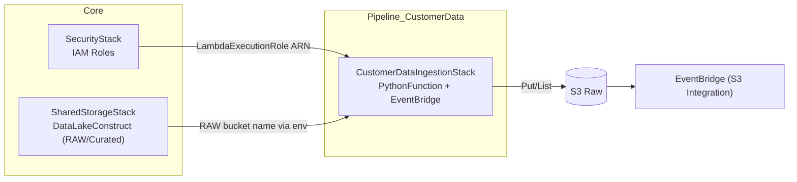

```mermaid
graph LR
  subgraph Core
    SS["SharedStorageStack<br/>DataLakeConstruct (RAW/Curated)"]
    SEC["SecurityStack<br/>IAM Roles"]
  end
  subgraph Pipeline_CustomerData
    ING["CustomerDataIngestionStack<br/>PythonFunction + EventBridge"]
  end
  SEC -->|LambdaExecutionRole ARN| ING
  SS -->|RAW bucket name via env| ING
  ING -->|Put/List| RAW[(S3 Raw)]
  RAW --> EB["EventBridge (S3 Integration)"]

```
