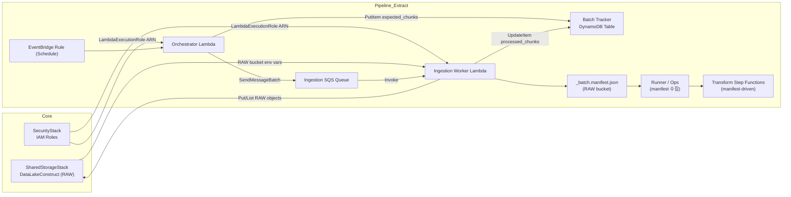

```mermaid
graph LR
  subgraph Core
    SS["SharedStorageStack<br/>DataLakeConstruct (RAW)"]
    SEC["SecurityStack<br/>IAM Roles"]
  end
  subgraph Pipeline_Extract
    EV["EventBridge Rule (Schedule)"]
    ORC["Orchestrator Lambda"]
    SQS["Ingestion SQS Queue"]
    WRK["Ingestion Worker Lambda"]
    DDB["Batch Tracker<br/>DynamoDB Table"]
    MAN["_batch.manifest.json<br/>(RAW bucket)"]
    OPS["Runner / Ops<br/>(manifest 수집)"]
    SFN["Transform Step Functions<br/>(manifest-driven)"]
  end

  SEC -->|LambdaExecutionRole ARN| ORC
  SEC -->|LambdaExecutionRole ARN| WRK
  SS -->|RAW bucket env vars| WRK
  EV --> ORC
  ORC -->|SendMessageBatch| SQS
  ORC -->|PutItem expected_chunks| DDB
  SQS -->|Invoke| WRK
  WRK -->|Put/List RAW objects| SS
  WRK -->|UpdateItem processed_chunks| DDB
  WRK --> MAN
  MAN --> OPS
  OPS --> SFN
```
