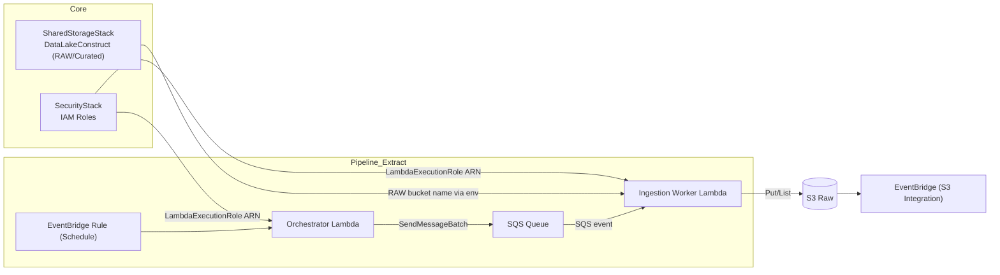

```mermaid
graph LR
  subgraph Core
    SS["SharedStorageStack<br/>DataLakeConstruct (RAW/Curated)"]
    SEC["SecurityStack<br/>IAM Roles"]
  end
  subgraph Pipeline_Extract
    EV["EventBridge Rule (Schedule)"]
    ORC["Orchestrator Lambda"]
    SQS["SQS Queue"]
    WRK["Ingestion Worker Lambda"]
  end
  SEC -->|LambdaExecutionRole ARN| ORC
  SEC -->|LambdaExecutionRole ARN| WRK
  SS -->|RAW bucket name via env| WRK
  EV --> ORC
  ORC -->|SendMessageBatch| SQS
  SQS -->|SQS event| WRK
  WRK -->|Put/List| RAW[(S3 Raw)]
  RAW --> EB["EventBridge (S3 Integration)"]

```
