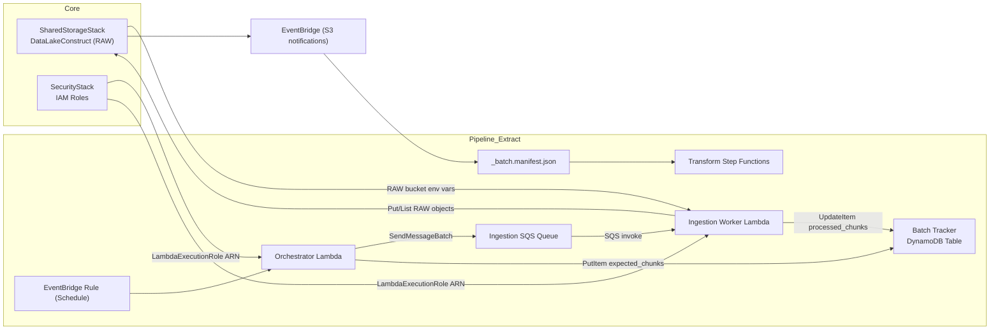

```mermaid
graph LR
  subgraph Core
    SS["SharedStorageStack<br/>DataLakeConstruct (RAW)"]
    SEC["SecurityStack<br/>IAM Roles"]
  end
  subgraph Pipeline_Extract
    EV["EventBridge Rule (Schedule)"]
    ORC["Orchestrator Lambda"]
    SQS["Ingestion SQS Queue"]
    WRK["Ingestion Worker Lambda"]
    DDB["Batch Tracker<br/>DynamoDB Table"]
    MAN["_batch.manifest.json"]
    SFN["Transform Step Functions"]
  end
  SEC -->|LambdaExecutionRole ARN| ORC
  SEC -->|LambdaExecutionRole ARN| WRK
  SS -->|RAW bucket env vars| WRK
  EV --> ORC
  ORC -->|SendMessageBatch| SQS
  ORC -->|PutItem expected_chunks| DDB
  SQS -->|SQS invoke| WRK
  WRK -->|Put/List RAW objects| SS
  WRK -->|UpdateItem processed_chunks| DDB
  SS --> EB["EventBridge (S3 notifications)"]
  EB --> MAN
  MAN --> SFN
```
