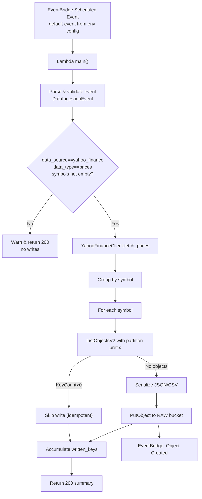

```mermaid
flowchart TD
  A["EventBridge Scheduled Event<br/>default event from env config"] --> B["Lambda main()"]
  B --> C["Parse & validate event<br/>DataIngestionEvent"]
  C --> D{data_source==yahoo_finance<br/>data_type==prices<br/>symbols not empty?}
  D -- No --> E["Warn & return 200<br/>no writes"]
  D -- Yes --> F["YahooFinanceClient.fetch_prices"]
  F --> G["Group by symbol"]
  G --> H["For each symbol"]
  H --> I["ListObjectsV2 with partition prefix"]
  I -->|KeyCount>0| J["Skip write (idempotent)"]
  I -->|No objects| K["Serialize JSON/CSV"]
  K --> L["PutObject to RAW bucket"]
  J --> M["Accumulate written_keys"]
  L --> M["Accumulate written_keys"]
  M --> Q["Return 200 summary"]
  L --> R["EventBridge: Object Created"]

```
