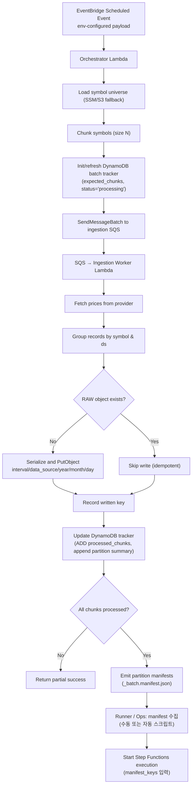

```mermaid
flowchart TD
  A["EventBridge Scheduled Event<br/>env-configured payload"] --> B["Orchestrator Lambda"]
  B --> C["Load symbol universe (SSM/S3 fallback)"]
  C --> D["Chunk symbols (size N)"]
  D --> E["Init/refresh DynamoDB batch tracker\n(expected_chunks, status='processing')"]
  E --> F["SendMessageBatch to ingestion SQS"]
  F --> G["SQS → Ingestion Worker Lambda"]
  G --> H["Fetch prices from provider"]
  H --> I["Group records by symbol & ds"]
  I --> J{RAW object exists?}
  J -->|Yes| K["Skip write (idempotent)"]
  J -->|No| L["Serialize and PutObject\ninterval/data_source/year/month/day"]
  L --> M["Record written key"]
  K --> M
  M --> N["Update DynamoDB tracker\n(ADD processed_chunks, append partition summary)"]
  N --> O{All chunks processed?}
  O -->|No| P["Return partial success"]
  O -->|Yes| Q["Emit partition manifests\n(_batch.manifest.json)"]
  Q --> R["Runner / Ops: manifest 수집\n(수동 또는 자동 스크립트)"]
  R --> S["Start Step Functions execution\n(manifest_keys 입력)"]

```
