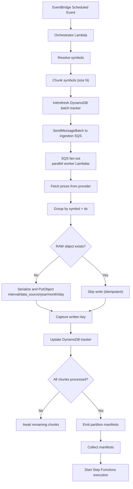

```mermaid
flowchart TD
  A["EventBridge Scheduled Event"] --> B["Orchestrator Lambda"]
  B --> C["Resolve symbols"]
  C --> D["Chunk symbols (size N)"]
  D --> E["Init/refresh DynamoDB batch tracker"]
  E --> F["SendMessageBatch to ingestion SQS"]
  F --> G["SQS fan-out<br/>parallel worker Lambdas"]
  G --> H["Fetch prices from provider"]
  H --> I["Group by symbol + ds"]
  I --> J{RAW object exists?}
  J -->|Yes| K["Skip write (idempotent)"]
  J -->|No| L["Serialize and PutObject <br>interval/data_source/year/month/day"]
  L --> M["Capture written key"]
  K --> M
  M --> N["Update DynamoDB tracker"]
  N --> O{All chunks processed?}
  O -->|No| P["Await remaining chunks"]
  O -->|Yes| Q["Emit partition manifests"]
  Q --> R["Collect manifests"]
  R --> S["Start Step Functions execution"]

```
