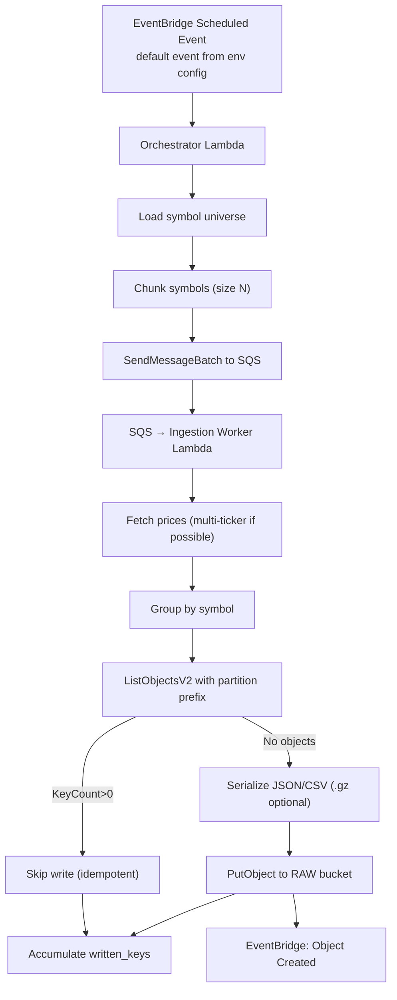

```mermaid
flowchart TD
  A["EventBridge Scheduled Event<br/>default event from env config"] --> B["Orchestrator Lambda"]
  B --> C["Load symbol universe"]
  C --> D["Chunk symbols (size N)"]
  D --> E["SendMessageBatch to SQS"]
  E --> F["SQS → Ingestion Worker Lambda"]
  F --> G["Fetch prices (multi-ticker if possible)"]
  G --> H["Group by symbol"]
  H --> I["ListObjectsV2 with partition prefix"]
  I -->|KeyCount>0| J["Skip write (idempotent)"]
  I -->|No objects| K["Serialize JSON/CSV (.gz optional)"]
  K --> L["PutObject to RAW bucket"]
  J --> M["Accumulate written_keys"]
  L --> M["Accumulate written_keys"]
  L --> R["EventBridge: Object Created"]

```
