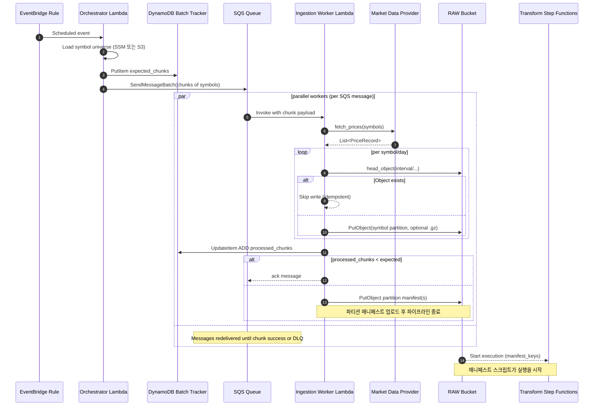

```mermaid
sequenceDiagram
  autonumber
  participant EV as EventBridge Rule
  participant ORC as Orchestrator Lambda
  participant DDB as DynamoDB Batch Tracker
  participant SQS as SQS Queue
  participant WRK as Ingestion Worker Lambda
  participant PRV as Market Data Provider
  participant S3 as RAW Bucket
  participant SF as Transform Step Functions

  EV->>ORC: Scheduled event
  ORC->>ORC: Load symbol universe (SSM 또는 S3)
  ORC->>DDB: PutItem expected_chunks
  ORC->>SQS: SendMessageBatch(chunks of symbols)

  par parallel workers (per SQS message)
    SQS->>WRK: Invoke with chunk payload
    WRK->>PRV: fetch_prices(symbols)
    PRV-->>WRK: List<PriceRecord>
    loop per symbol/day
      WRK->>S3: head_object(interval/...)
      alt Object exists
        WRK-->>WRK: Skip write (idempotent)
      else
        WRK->>S3: PutObject(symbol partition, optional .gz)
      end
    end
    WRK->>DDB: UpdateItem ADD processed_chunks
    alt processed_chunks < expected
      WRK-->>SQS: ack message
    else
      WRK->>S3: PutObject partition manifest(s)
      Note over WRK,S3: 파티션 매니페스트 업로드 후 파이프라인 종료
    end
  and
    Note over SQS: Messages redelivered until chunk success or DLQ
  end

  S3-->>SF: Start execution (manifest_keys)
  Note over S3,SF: 매니페스트 스크립트가 실행을 시작
```
