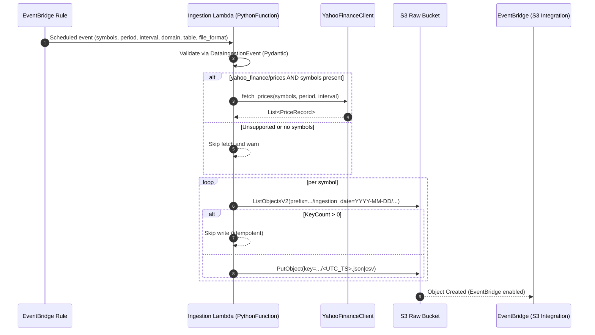

```mermaid
sequenceDiagram
  autonumber
  participant EV as EventBridge Rule
  participant L as Ingestion Lambda (PythonFunction)
  participant YF as YahooFinanceClient
  participant S3 as S3 Raw Bucket
  participant EB as EventBridge (S3 Integration)

  EV->>L: Scheduled event (symbols, period, interval, domain, table, file_format)
  L->>L: Validate via DataIngestionEvent (Pydantic)
  alt yahoo_finance/prices AND symbols present
    L->>YF: fetch_prices(symbols, period, interval)
    YF-->>L: List<PriceRecord>
  else Unsupported or no symbols
    L-->>L: Skip fetch and warn
  end
  loop per symbol
    L->>S3: ListObjectsV2(prefix=.../ingestion_date=YYYY-MM-DD/...)
    alt KeyCount > 0
      L-->>L: Skip write (idempotent)
    else
      L->>S3: PutObject(key=.../<UTC_TS>.json|csv)
    end
  end
  S3-->>EB: Object Created (EventBridge enabled)

```
