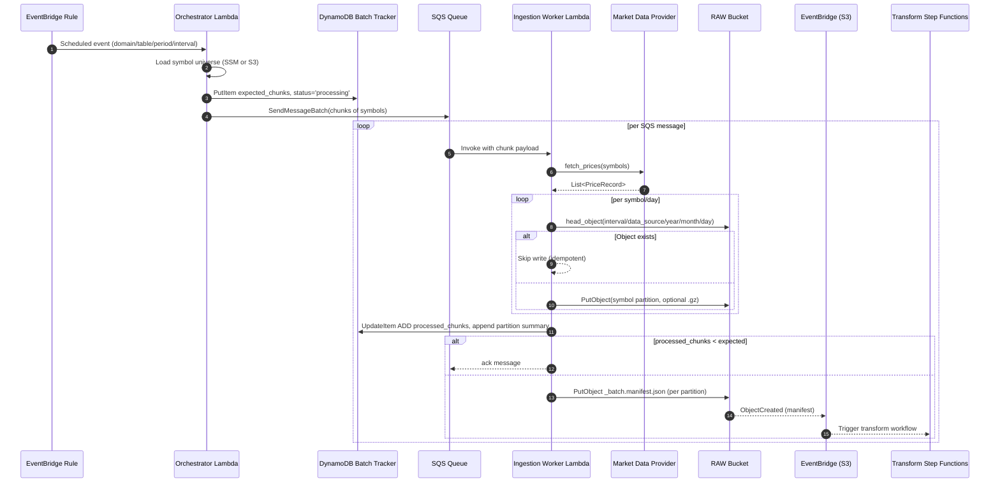

```mermaid
sequenceDiagram
  autonumber
  participant EV as EventBridge Rule
  participant ORC as Orchestrator Lambda
  participant DDB as DynamoDB Batch Tracker
  participant SQS as SQS Queue
  participant WRK as Ingestion Worker Lambda
  participant PRV as Market Data Provider
  participant S3 as RAW Bucket
  participant EB as EventBridge (S3)
  participant SF as Transform Step Functions

  EV->>ORC: Scheduled event (domain/table/period/interval)
  ORC->>ORC: Load symbol universe (SSM or S3)
  ORC->>DDB: PutItem expected_chunks, status='processing'
  ORC->>SQS: SendMessageBatch(chunks of symbols)

  loop per SQS message
    SQS->>WRK: Invoke with chunk payload
    WRK->>PRV: fetch_prices(symbols)
    PRV-->>WRK: List<PriceRecord>
    loop per symbol/day
      WRK->>S3: head_object(interval/data_source/year/month/day)
      alt Object exists
        WRK-->>WRK: Skip write (idempotent)
      else
        WRK->>S3: PutObject(symbol partition, optional .gz)
      end
    end
    WRK->>DDB: UpdateItem ADD processed_chunks, append partition summary
    alt processed_chunks < expected
      WRK-->>SQS: ack message
    else
      WRK->>S3: PutObject _batch.manifest.json (per partition)
      S3-->>EB: ObjectCreated (manifest)
      EB-->>SF: Trigger transform workflow
    end
  end

```
