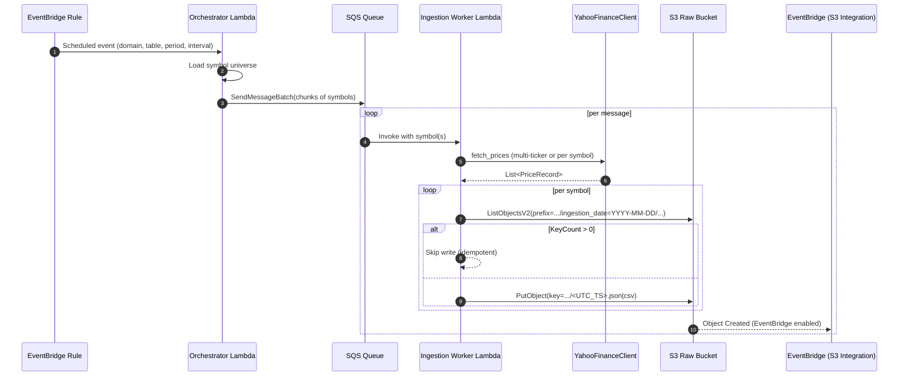

```mermaid
sequenceDiagram
  autonumber
  participant EV as EventBridge Rule
  participant ORC as Orchestrator Lambda
  participant SQS as SQS Queue
  participant WRK as Ingestion Worker Lambda
  participant YF as YahooFinanceClient
  participant S3 as S3 Raw Bucket
  participant EB as EventBridge (S3 Integration)

  EV->>ORC: Scheduled event (domain, table, period, interval)
  ORC->>ORC: Load symbol universe
  ORC->>SQS: SendMessageBatch(chunks of symbols)
  loop per message
    SQS->>WRK: Invoke with symbol(s)
    WRK->>YF: fetch_prices (multi-ticker or per symbol)
    YF-->>WRK: List<PriceRecord>
    loop per symbol
      WRK->>S3: ListObjectsV2(prefix=.../ingestion_date=YYYY-MM-DD/...)
      alt KeyCount > 0
        WRK-->>WRK: Skip write (idempotent)
      else
        WRK->>S3: PutObject(key=.../<UTC_TS>.json|csv)
      end
    end
    S3-->>EB: Object Created (EventBridge enabled)
  end

```
