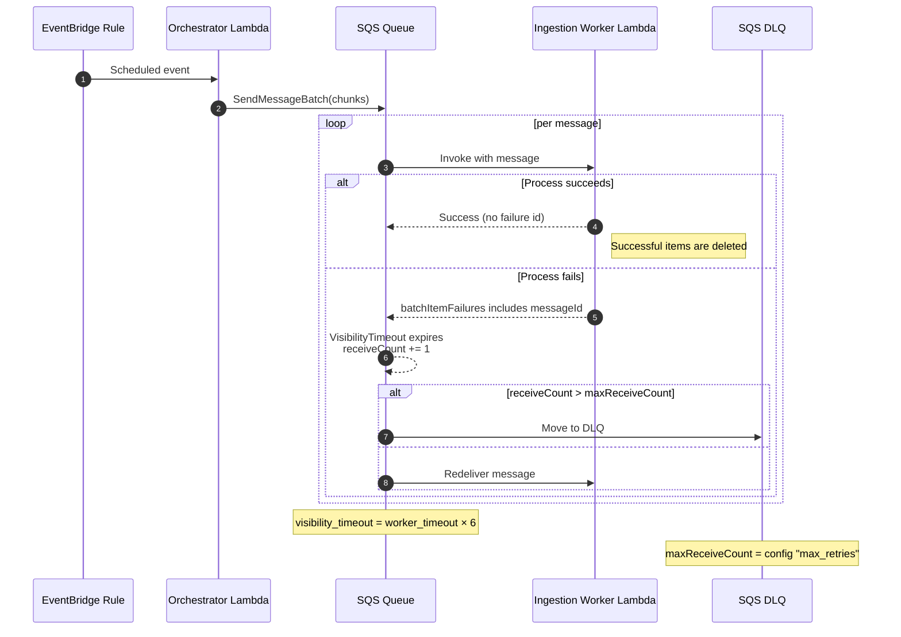

```mermaid
sequenceDiagram
  autonumber
  participant EV as EventBridge Rule
  participant ORC as Orchestrator Lambda
  participant SQS as SQS Queue
  participant WRK as Ingestion Worker Lambda
  participant DLQ as SQS DLQ

  EV->>ORC: Scheduled event
  ORC->>SQS: SendMessageBatch(chunks)
  loop per message
    SQS->>WRK: Invoke with message
    alt Process succeeds
      WRK-->>SQS: Success (no failure id)
      Note right of WRK: Successful items are deleted
    else Process fails
      WRK-->>SQS: batchItemFailures includes messageId
      SQS-->>SQS: VisibilityTimeout expires<br/>receiveCount += 1
      alt receiveCount > maxReceiveCount
        SQS->>DLQ: Move to DLQ
      else
        SQS->>WRK: Redeliver message
      end
    end
  end

  Note over SQS: visibility_timeout = worker_timeout × 6
  Note over DLQ: maxReceiveCount = config "max_retries"
```

