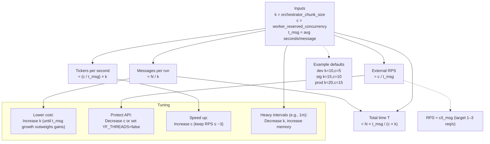

```mermaid
flowchart TD
  A["Inputs<br/>k = orchestrator_chunk_size<br/>c = worker_reserved_concurrency<br/>t_msg = avg seconds/message"]
  B["Messages per run<br/>≈ N / k"]
  C["External RPS<br/>≈ c / t_msg"]
  D["Tickers per second<br/>≈ (c / t_msg) × k"]
  E["Total time T<br/>≈ N × t_msg / (c × k)"]

  A --> B
  A --> C
  A --> D
  A --> E
  B --> E

  subgraph Tuning
    F["Lower cost:<br/>Increase k (until t_msg growth outweighs gains)"]
    G["Protect API:<br/>Decrease c or set YF_THREADS=false"]
    H["Speed up:<br/>Increase c (keep RPS ≤ ~3)"]
    I["Heavy intervals (e.g., 1m):<br/>Decrease k, increase memory"]
  end

  C --> G
  D --> H
  B --> F
  A --> I

  N1["Example defaults<br/>dev k=10,c=5<br/>stg k=15,c=10<br/>prod k=20,c=15"]
  N2["RPS ≈ c/t_msg (target 1–3 req/s)"]
  A -.-> N1
  C -.-> N2
```
