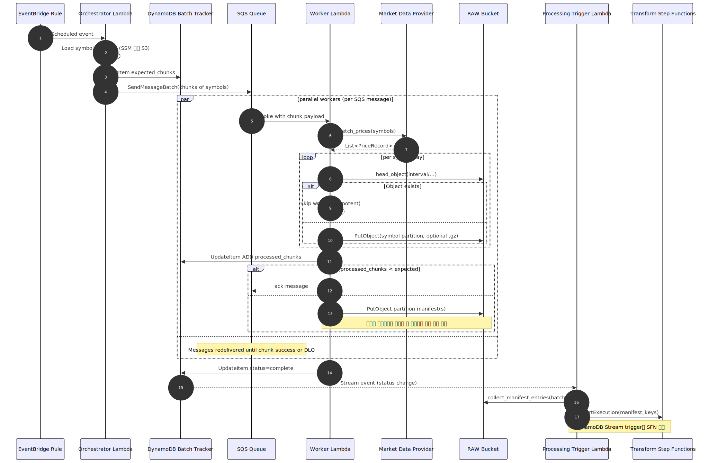

# Extract Diagrams Overview

| Diagram | 미리보기 | 설명 |
|---------|-----------|------|
| Components |  | 스택/컴포넌트 간 의존 관계 |
| Flow |  | EventBridge → Orchestrator → Worker 전체 흐름 |
| Sequence |  | 매니페스트 생성까지의 시퀀스 다이어그램 |
| Retry & DLQ |  | SQS 재시도/실패 처리 패턴 |
| Concurrency & RPS |  | 청크 크기·동시성에 따른 처리량 추산 |

