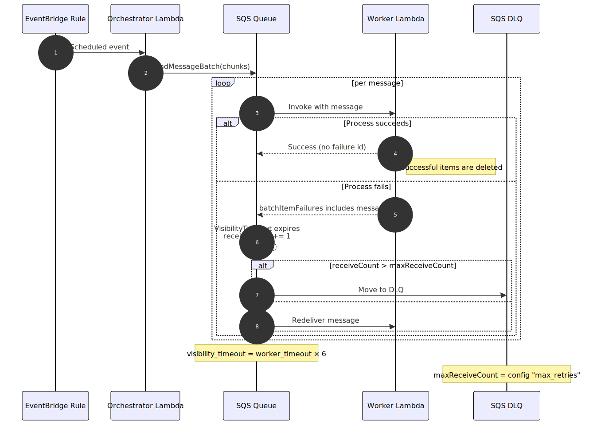

# Extract Diagrams Overview

<table style="width:100%; table-layout:fixed;">
  <thead>
    <tr>
      <th style="width:15%;">Diagram</th>
      <th style="width:55%;">미리보기</th>
      <th style="width:30%;">설명</th>
    </tr>
  </thead>
  <tbody>
    <tr>
      <td>Components</td>
      <td></td>
      <td>스택/컴포넌트 간 의존 관계</td>
    </tr>
    <tr>
      <td>Flow</td>
      <td></td>
      <td>EventBridge → Orchestrator → Worker 전체 흐름</td>
    </tr>
    <tr>
      <td>Sequence</td>
      <td></td>
      <td>매니페스트 생성까지의 시퀀스 다이어그램</td>
    </tr>
    <tr>
      <td>Retry &amp; DLQ</td>
      <td></td>
      <td>SQS 재시도/실패 처리 패턴</td>
    </tr>
    <tr>
      <td>Concurrency &amp; RPS</td>
      <td></td>
      <td>청크 크기·동시성에 따른 처리량 추산</td>
    </tr>
  </tbody>
</table>
