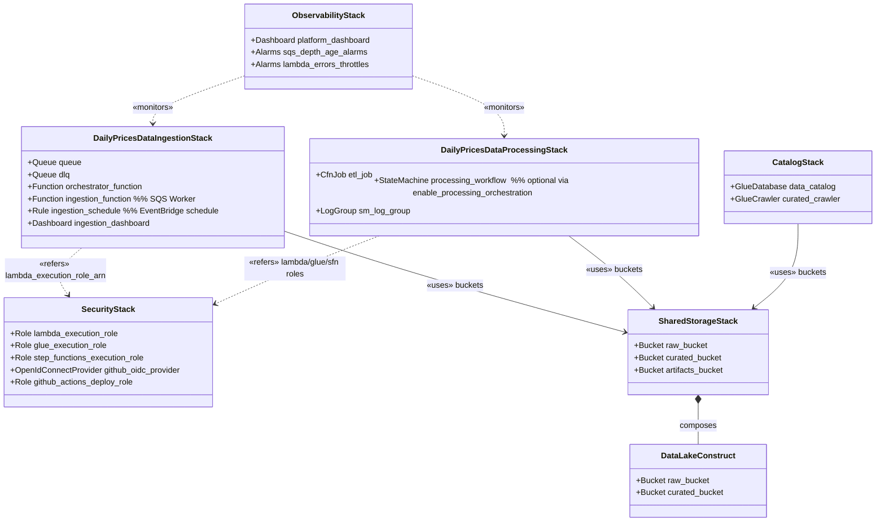

```mermaid
classDiagram
  %% Core security stack
  class SecurityStack {
    +Role lambda_execution_role
    +Role glue_execution_role
    +Role step_functions_execution_role
    +OpenIdConnectProvider github_oidc_provider
    +Role github_actions_deploy_role
  }

  %% Shared storage (Data Lake)
  class SharedStorageStack {
    +Bucket raw_bucket
    +Bucket curated_bucket
    +Bucket artifacts_bucket
  }

  class DataLakeConstruct {
    +Bucket raw_bucket
    +Bucket curated_bucket
  }

  %% Extract pipeline (fan-out ingestion)
  class DailyPricesDataIngestionStack {
    +Queue queue
    +Queue dlq
    +Function orchestrator_function
    +Function ingestion_function  %% SQS Worker
    +Rule ingestion_schedule       %% EventBridge schedule
    +Dashboard ingestion_dashboard
  }

  %% Transform pipeline (processing/orchestration)
  class DailyPricesDataProcessingStack {
    +CfnJob etl_job
    +StateMachine processing_workflow  %% optional via enable_processing_orchestration
    +LogGroup sm_log_group
  }

  %% Platform/Observability & Governance
  class ObservabilityStack {
    +Dashboard platform_dashboard
    +Alarms sqs_depth_age_alarms
    +Alarms lambda_errors_throttles
  }

  class CatalogStack {
    +GlueDatabase data_catalog
    +GlueCrawler curated_crawler
  }

  %% Relationships
  SharedStorageStack *-- DataLakeConstruct : composes

  DailyPricesDataIngestionStack --> SharedStorageStack : «uses» buckets
  DailyPricesDataProcessingStack --> SharedStorageStack : «uses» buckets
  CatalogStack --> SharedStorageStack : «uses» buckets

  DailyPricesDataIngestionStack ..> SecurityStack : «refers» lambda_execution_role_arn
  DailyPricesDataProcessingStack ..> SecurityStack : «refers» lambda/glue/sfn roles
  ObservabilityStack ..> DailyPricesDataIngestionStack : «monitors»
  ObservabilityStack ..> DailyPricesDataProcessingStack : «monitors»

```
