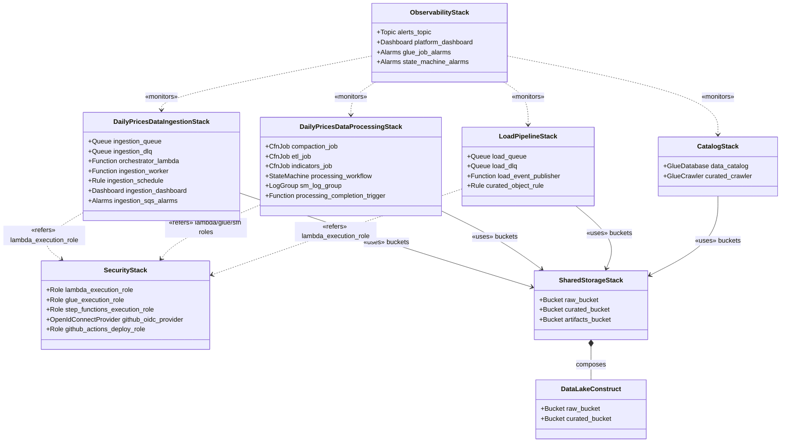

```mermaid
classDiagram
  %% Core security & shared storage
  class SecurityStack {
    +Role lambda_execution_role
    +Role glue_execution_role
    +Role step_functions_execution_role
    +OpenIdConnectProvider github_oidc_provider
    +Role github_actions_deploy_role
  }

  class SharedStorageStack {
    +Bucket raw_bucket
    +Bucket curated_bucket
    +Bucket artifacts_bucket
  }

  class DataLakeConstruct {
    +Bucket raw_bucket
    +Bucket curated_bucket
  }

  %% Pipelines
  class DailyPricesDataIngestionStack {
    +Queue ingestion_queue
    +Queue ingestion_dlq
    +Function orchestrator_lambda
    +Function ingestion_worker
    +Rule ingestion_schedule
    +Dashboard ingestion_dashboard
    +Alarms ingestion_sqs_alarms
  }

  class DailyPricesDataProcessingStack {
    +CfnJob compaction_job
    +CfnJob etl_job
    +CfnJob indicators_job
    +StateMachine processing_workflow
    +LogGroup sm_log_group
    +Function processing_completion_trigger
  }

  class LoadPipelineStack {
    +Queue load_queue
    +Queue load_dlq
    +Function load_event_publisher
    +Rule curated_object_rule
  }

  %% Platform/Observability & Governance
  class ObservabilityStack {
    +Topic alerts_topic
    +Dashboard platform_dashboard
    +Alarms glue_job_alarms
    +Alarms state_machine_alarms
  }

  class CatalogStack {
    +GlueDatabase data_catalog
    +GlueCrawler curated_crawler
  }

  %% Relationships
  SharedStorageStack *-- DataLakeConstruct : composes

  DailyPricesDataIngestionStack --> SharedStorageStack : «uses» buckets
  DailyPricesDataProcessingStack --> SharedStorageStack : «uses» buckets
  LoadPipelineStack --> SharedStorageStack : «uses» buckets
  CatalogStack --> SharedStorageStack : «uses» buckets

  DailyPricesDataIngestionStack ..> SecurityStack : «refers» lambda_execution_role
  DailyPricesDataProcessingStack ..> SecurityStack : «refers» lambda/glue/sfn roles
  LoadPipelineStack ..> SecurityStack : «refers» lambda_execution_role

  ObservabilityStack ..> DailyPricesDataIngestionStack : «monitors»
  ObservabilityStack ..> DailyPricesDataProcessingStack : «monitors»
  ObservabilityStack ..> LoadPipelineStack : «monitors»
  ObservabilityStack ..> CatalogStack : «monitors»
```
