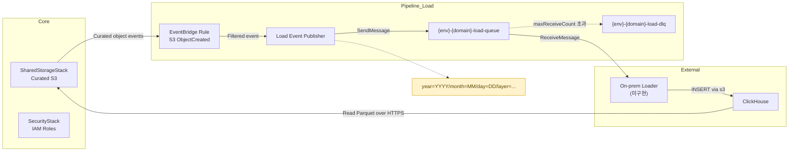

```mermaid
graph LR
  subgraph Core
    SS["SharedStorageStack<br/>Curated S3"]
    SEC["SecurityStack<br/>IAM Roles"]
  end

  subgraph Pipeline_Load
    EB["EventBridge Rule<br/>S3 ObjectCreated"]
    PUB["Load Event Publisher"]
    SQS["{env}-{domain}-load-queue"]
    DLQ["{env}-{domain}-load-dlq"]
  end

  subgraph External
    AGT["On‑prem Loader<br/>(미구현)"]
    CH["ClickHouse"]
  end

  SS -->|Curated object events| EB
  EB -->|Filtered event| PUB
  PUB -->|SendMessage| SQS
  SQS -.->|maxReceiveCount 초과| DLQ

  %% External consumption (예정)
  SQS -->|ReceiveMessage| AGT
  AGT -->|INSERT via s3| CH
  CH -->|Read Parquet over HTTPS| SS

  %% Notes
  N2["year=YYYY/month=MM/day=DD/layer=... "]:::note

  PUB -.-> N2

  classDef note fill:#fff3cd,stroke:#d39e00,color:#5c4800;
```
