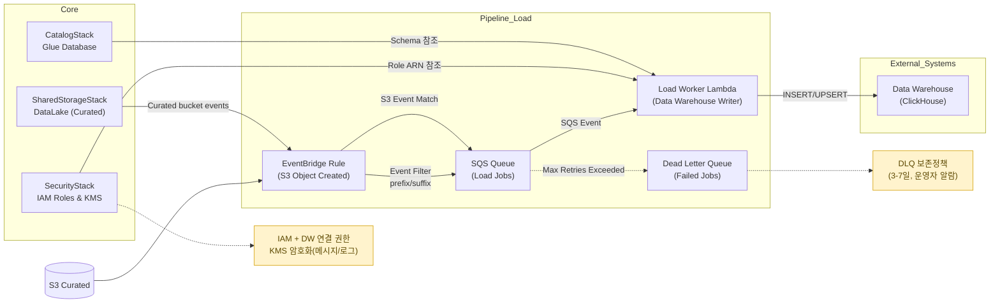

```mermaid
graph LR
  subgraph Core
    SS["SharedStorageStack<br/>DataLake (Curated)"]
    SEC["SecurityStack<br/>IAM Roles & KMS"]
    GOV["CatalogStack<br/>Glue Database"]
  end

  subgraph Pipeline_Load
    EB["EventBridge Rule<br/>(S3 Object Created)"]
    SQS["SQS Queue<br/>(Load Jobs)"]
    DLQ["Dead Letter Queue<br/>(Failed Jobs)"]
    LOAD["Load Worker Lambda<br/>(Data Warehouse Writer)"]
  end

  subgraph External_Systems
    DW["Data Warehouse<br/>(ClickHouse)"]
  end

  SS -->|Curated bucket events| EB
  GOV -->|Schema 참조| LOAD
  SEC -->|Role ARN 참조| LOAD

  EB -->|S3 Event Match| SQS
  SQS -->|SQS Event| LOAD
  SQS -.->|Max Retries Exceeded| DLQ
  LOAD -->|INSERT/UPSERT| DW

  CUR[(S3 Curated)] --> EB
  EB -->|Event Filter<br/>prefix/suffix| SQS

  %% Load/Security notes
  N1["IAM + DW 연결 권한<br/>KMS 암호화(메시지/로그)"]:::note
  N2["DLQ 보존정책<br/>(3-7일, 운영자 알람)"]:::note
  SEC -.-> N1
  DLQ -.-> N2

  classDef note fill:#fff3cd,stroke:#d39e00,color:#5c4800;
```