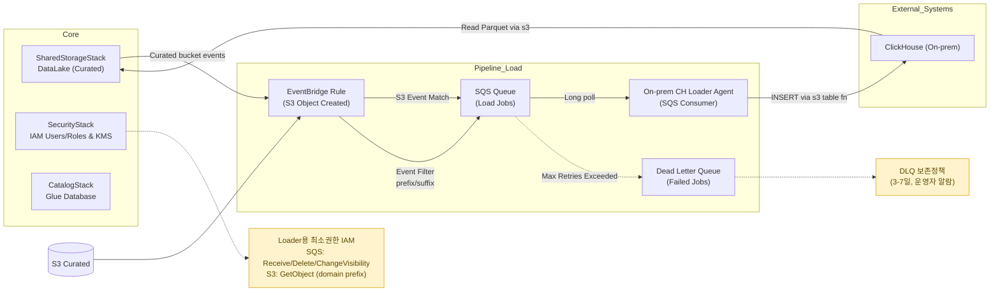

```mermaid
graph LR
  subgraph Core
    SS["SharedStorageStack<br/>DataLake (Curated)"]
    SEC["SecurityStack<br/>IAM Users/Roles & KMS"]
    GOV["CatalogStack<br/>Glue Database"]
  end

  subgraph Pipeline_Load
    EB["EventBridge Rule<br/>(S3 Object Created)"]
    SQS["SQS Queue<br/>(Load Jobs)"]
    DLQ["Dead Letter Queue<br/>(Failed Jobs)"]
    AGT["On‑prem CH Loader Agent<br/>(SQS Consumer)"]
  end

  subgraph External_Systems
    DW["ClickHouse (On‑prem)"]
  end

  SS -->|Curated bucket events| EB
  EB -->|S3 Event Match| SQS
  SQS -->|Long poll| AGT
  SQS -.->|Max Retries Exceeded| DLQ

  AGT -->|INSERT via s3 table fn| DW
  DW -->|Read Parquet via s3| SS

  CUR[(S3 Curated)] --> EB
  EB -->|Event Filter<br/>prefix/suffix| SQS

  %% Security/ops notes
  N1["Loader용 최소권한 IAM<br/>SQS: Receive/Delete/ChangeVisibility<br/>S3: GetObject (domain prefix)"]:::note
  N2["DLQ 보존정책<br/>(3-7일, 운영자 알람)"]:::note
  SEC -.-> N1
  DLQ -.-> N2

  classDef note fill:#fff3cd,stroke:#d39e00,color:#5c4800;
```
