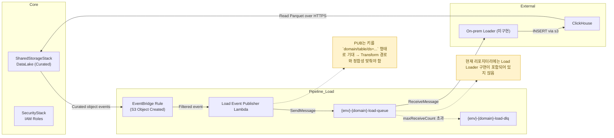

```mermaid
graph LR
  subgraph Core
    SS["SharedStorageStack<br/>DataLake (Curated)"]
    SEC["SecurityStack<br/>IAM Roles"]
  end

  subgraph Pipeline_Load
    EB["EventBridge Rule<br/>(S3 Object Created)"]
    PUB["Load Event Publisher Lambda"]
    SQS["{env}-{domain}-load-queue"]
    DLQ["{env}-{domain}-load-dlq"]
  end

  subgraph External
    AGT["On‑prem Loader (미구현)"]
    CH["ClickHouse"]
  end

  SS -->|Curated object events| EB
  EB -->|Filtered event| PUB
  PUB -->|SendMessage| SQS
  SQS -.->|maxReceiveCount 초과| DLQ

  %% External consumption (예정)
  SQS -->|ReceiveMessage| AGT
  AGT -->|INSERT via s3| CH
  CH -->|Read Parquet over HTTPS| SS

  %% Notes
  N1["현재 리포지터리에는 Load Loader 구현이 포함되어 있지 않음"]:::note
  N2["PUB는 키를 `domain/table/ds=...` 형태로 기대 → Transform 경로와 정합성 맞춰야 함"]:::note

  SQS -.-> N1
  PUB -.-> N2

  classDef note fill:#fff3cd,stroke:#d39e00,color:#5c4800;
```
