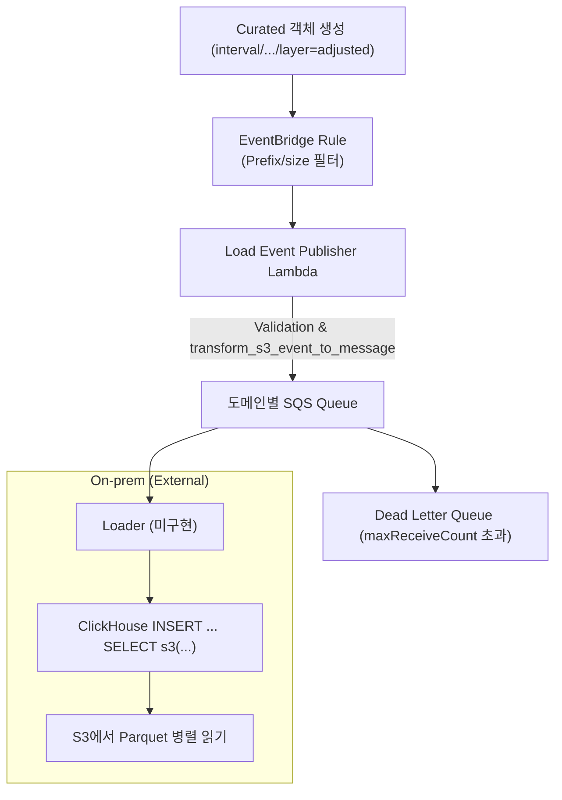

```mermaid
flowchart TD
  A["Curated 객체 생성 (interval/.../layer=adjusted)"] --> B["EventBridge Rule\n(Prefix/size 필터)"]
  B --> C["Load Event Publisher Lambda"]
  C -->|Validation & transform_s3_event_to_message| D["도메인별 SQS Queue"]
  D --> E["Dead Letter Queue (maxReceiveCount 초과)"]
  D --> F["Loader (미구현)"]
  subgraph "On-prem (External)"
    F --> G["ClickHouse INSERT ... SELECT s3(...)"]
    G --> H["S3에서 Parquet 병렬 읽기"]
  end


  classDef note fill:#fff3cd,stroke:#d39e00,color:#5c4800;
```
