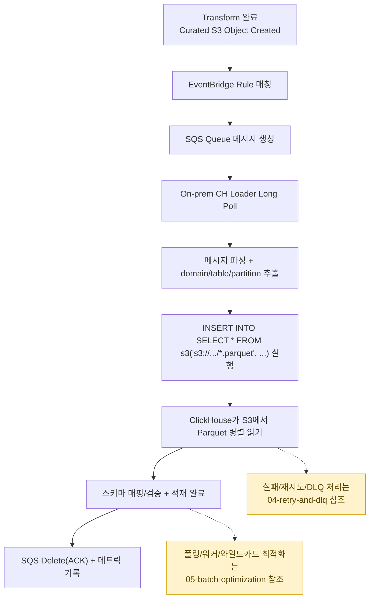

```mermaid
flowchart TD
  A["Transform 완료<br/>Curated S3 Object Created"] --> B["EventBridge Rule 매칭"]
  B --> C["SQS Queue 메시지 생성"]
  C --> D["On‑prem CH Loader Long Poll"]
  D --> E["메시지 파싱 + domain/table/partition 추출"]
  E --> F["INSERT INTO <table>\nSELECT * FROM s3('s3://.../*.parquet', ...) 실행"]
  F --> G["ClickHouse가 S3에서 Parquet 병렬 읽기"]
  G --> H["스키마 매핑/검증 + 적재 완료"]
  H --> I["SQS Delete(ACK) + 메트릭 기록"]

  %% DLQ 상세 처리 참고 노트
  NDQ["실패/재시도/DLQ 처리는<br/>04-retry-and-dlq 참조"]:::note
  G -.-> NDQ

  %% 배치/동시성 최적화 참고 노트
  NBATCH["폴링/워커/와일드카드 최적화는<br/>05-batch-optimization 참조"]:::note
  H -.-> NBATCH
  
  classDef note fill:#fff3cd,stroke:#d39e00,color:#5c4800;
```
