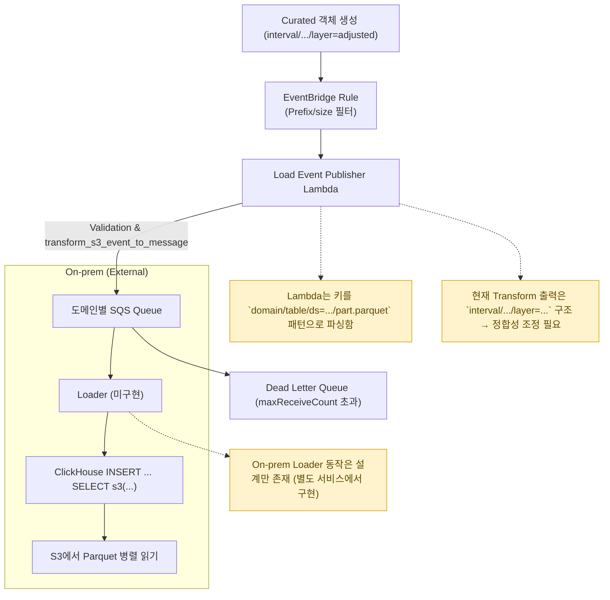

```mermaid
flowchart TD
  A["Curated 객체 생성 (interval/.../layer=adjusted)"] --> B["EventBridge Rule\n(Prefix/size 필터)"]
  B --> C["Load Event Publisher Lambda"]
  C -->|Validation & transform_s3_event_to_message| D["도메인별 SQS Queue"]
  D --> E["Dead Letter Queue (maxReceiveCount 초과)"]

  subgraph "On-prem (External)"
    D --> F["Loader (미구현)"]
    F --> G["ClickHouse INSERT ... SELECT s3(...)"]
    G --> H["S3에서 Parquet 병렬 읽기"]
  end

  %% Notes
  N1["Lambda는 키를 `domain/table/ds=.../part.parquet` 패턴으로 파싱함"]:::note
  N2["현재 Transform 출력은 `interval/.../layer=...` 구조 → 정합성 조정 필요"]:::note
  N3["On-prem Loader 동작은 설계만 존재 (별도 서비스에서 구현)"]:::note

  C -.-> N1
  C -.-> N2
  F -.-> N3

  classDef note fill:#fff3cd,stroke:#d39e00,color:#5c4800;
```
