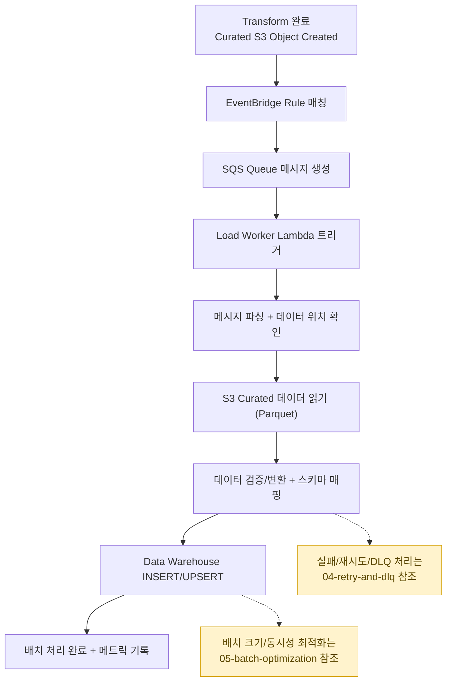

```mermaid
flowchart TD
  A["Transform 완료<br/>Curated S3 Object Created"] --> B["EventBridge Rule 매칭"]
  B --> C["SQS Queue 메시지 생성"]
  C --> D["Load Worker Lambda 트리거"]
  D --> E["메시지 파싱 + 데이터 위치 확인"]
  E --> F["S3 Curated 데이터 읽기 (Parquet)"]
  F --> G["데이터 검증/변환 + 스키마 매핑"]
  G --> H["Data Warehouse INSERT/UPSERT"]
  H --> I["배치 처리 완료 + 메트릭 기록"]

  %% DLQ 상세 처리 참고 노트
  NDQ["실패/재시도/DLQ 처리는<br/>04-retry-and-dlq 참조"]:::note
  G -.-> NDQ

  %% 배치 최적화 참고 노트
  NBATCH["배치 크기/동시성 최적화는<br/>05-batch-optimization 참조"]:::note
  H -.-> NBATCH
  
  classDef note fill:#fff3cd,stroke:#d39e00,color:#5c4800;
```