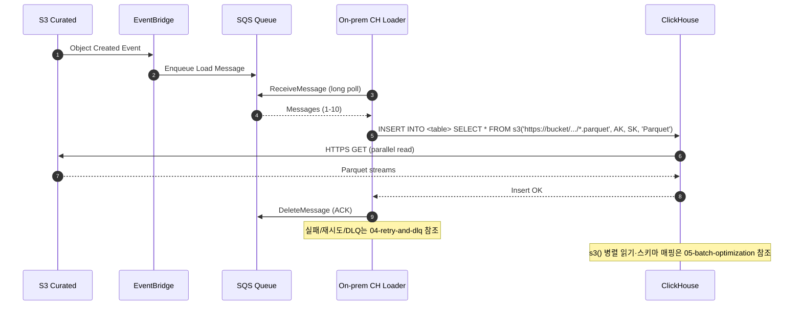

```mermaid
sequenceDiagram
  autonumber
  participant S3 as S3 Curated
  participant EB as EventBridge
  participant SQS as SQS Queue
  participant AGT as On‑prem CH Loader
  participant CH as ClickHouse

  S3->>EB: Object Created Event
  EB->>SQS: Enqueue Load Message
  AGT->>SQS: ReceiveMessage (long poll)
  SQS-->>AGT: Messages (1-10)
  AGT->>CH: INSERT INTO <table> SELECT * FROM s3('https://bucket/.../*.parquet', AK, SK, 'Parquet')
  CH->>S3: HTTPS GET (parallel read)
  S3-->>CH: Parquet streams
  CH-->>AGT: Insert OK
  AGT->>SQS: DeleteMessage (ACK)

  Note over AGT: 실패/재시도/DLQ는 04-retry-and-dlq 참조
  Note over CH: s3() 병렬 읽기·스키마 매핑은 05-batch-optimization 참조
```
