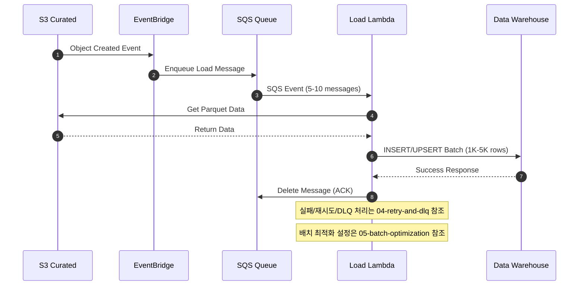

```mermaid
sequenceDiagram
  autonumber
  participant S3 as S3 Curated
  participant EB as EventBridge
  participant SQS as SQS Queue
  participant LOAD as Load Lambda
  participant DW as Data Warehouse

  S3->>EB: Object Created Event
  EB->>SQS: Enqueue Load Message
  SQS->>LOAD: SQS Event (5-10 messages)
  LOAD->>S3: Get Parquet Data
  S3-->>LOAD: Return Data
  LOAD->>DW: INSERT/UPSERT Batch (1K-5K rows)
  DW-->>LOAD: Success Response
  LOAD->>SQS: Delete Message (ACK)

  Note over LOAD: 실패/재시도/DLQ 처리는 04-retry-and-dlq 참조
  Note over LOAD: 배치 최적화 설정은 05-batch-optimization 참조
```