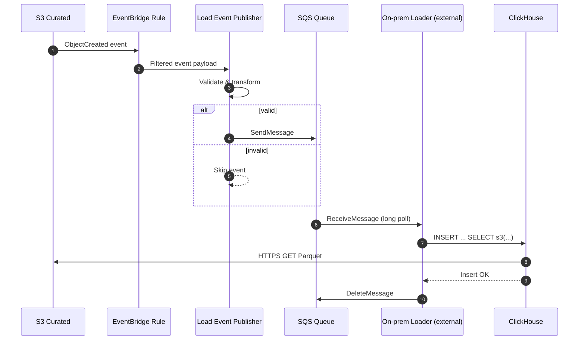

```mermaid
sequenceDiagram
  autonumber
  participant S3 as S3 Curated
  participant EB as EventBridge Rule
  participant LMB as Load Event Publisher
  participant SQS as SQS Queue
  participant AGT as On‑prem Loader (external)
  participant CH as ClickHouse

  S3->>EB: ObjectCreated event
  EB->>LMB: Filtered event payload
  LMB->>LMB: Validate & transform
  alt valid
    LMB->>SQS: SendMessage
  else invalid
    LMB-->>LMB: Skip event
  end

  %% External consumption (아직 구성되지 않음)
  SQS->>AGT: ReceiveMessage (long poll)
  AGT->>CH: INSERT ... SELECT s3(...)
  CH->>S3: HTTPS GET Parquet
  CH-->>AGT: Insert OK
  AGT->>SQS: DeleteMessage

```
