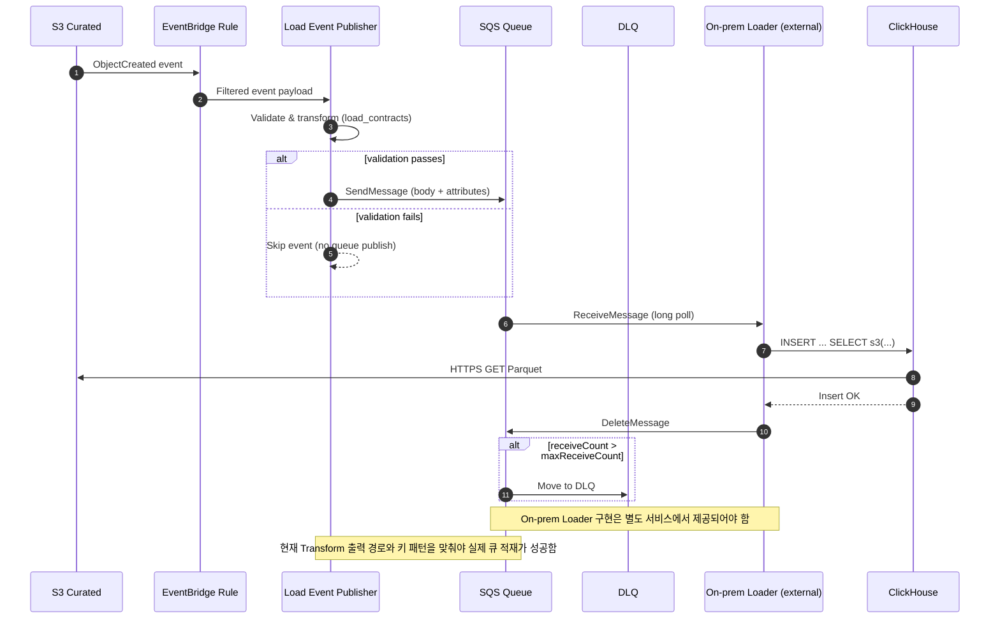

```mermaid
sequenceDiagram
  autonumber
  participant S3 as S3 Curated
  participant EB as EventBridge Rule
  participant LMB as Load Event Publisher
  participant SQS as SQS Queue
  participant DLQ as DLQ
  participant AGT as On‑prem Loader (external)
  participant CH as ClickHouse

  S3->>EB: ObjectCreated event
  EB->>LMB: Filtered event payload
  LMB->>LMB: Validate & transform (load_contracts)
  alt validation passes
    LMB->>SQS: SendMessage (body + attributes)
  else validation fails
    LMB-->>LMB: Skip event (no queue publish)
  end

  %% External consumption (아직 구성되지 않음)
  SQS->>AGT: ReceiveMessage (long poll)
  AGT->>CH: INSERT ... SELECT s3(...)
  CH->>S3: HTTPS GET Parquet
  CH-->>AGT: Insert OK
  AGT->>SQS: DeleteMessage
  alt receiveCount > maxReceiveCount
    SQS->>DLQ: Move to DLQ
  end

  Note over AGT,SQS: On‑prem Loader 구현은 별도 서비스에서 제공되어야 함
  Note over LMB,SQS: 현재 Transform 출력 경로와 키 패턴을 맞춰야 실제 큐 적재가 성공함
```
