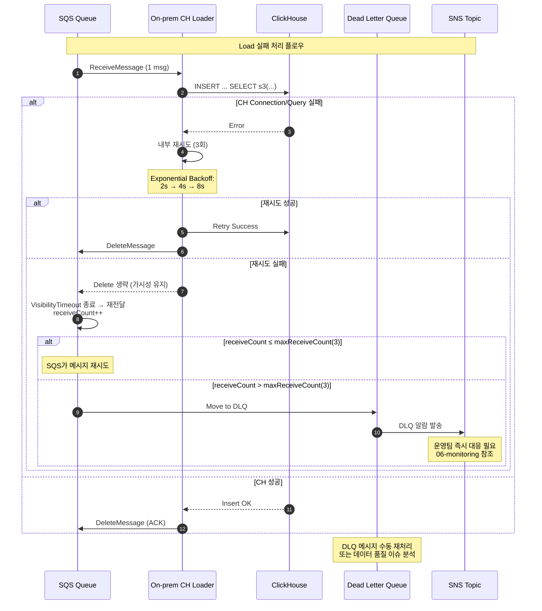

# Load Retry & DLQ Handling (Pull Model)

## 재시도 전략 상세

### **Loader 내부 재시도**
- **횟수**: 3회 (총 4회 시도)
- **백오프**: Exponential (2초 → 4초 → 8초)
- **대상 오류**: CH 연결/일시 쿼리 실패, S3 일시적 오류

### **SQS 레벨 재시도**
- **maxReceiveCount**: 3 (총 3회 재전달 후 DLQ)
- **VisibilityTimeout**: per‑message timeout × 6 (권장: 1800초)
- **redrive 정책**: 초과 시 자동 DLQ 이동

### **DLQ 처리**
- **즉시 알람**: SNS → Slack/Email
- **수동 처리**: 운영팀 개입 필요
- **재처리**: DLQ → 원본 Queue 수동 이동

참조: 03-sequence.md (정상 플로우), 06-monitoring-metrics.md (알람 설정)
