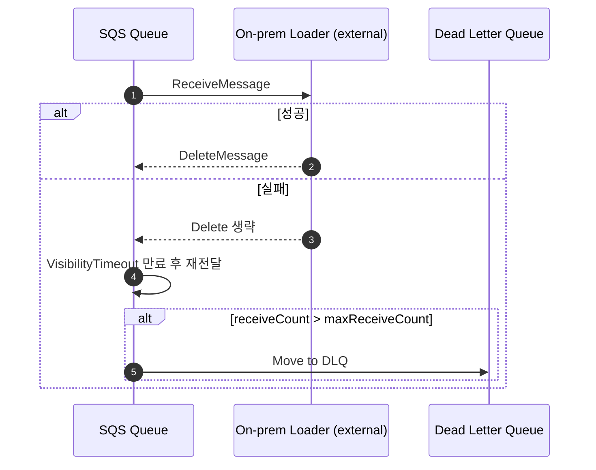

# Load Retry & DLQ Handling

```mermaid
sequenceDiagram
  autonumber
  participant SQS as SQS Queue
  participant AGT as On‑prem Loader (external)
  participant DLQ as Dead Letter Queue

  SQS->>AGT: ReceiveMessage
  alt 성공
    AGT-->>SQS: DeleteMessage
  else 실패
    AGT-->>SQS: Delete 생략
    SQS->>SQS: VisibilityTimeout 만료 후 재전달
    alt receiveCount > maxReceiveCount
      SQS->>DLQ: Move to DLQ
    end
  end
```

