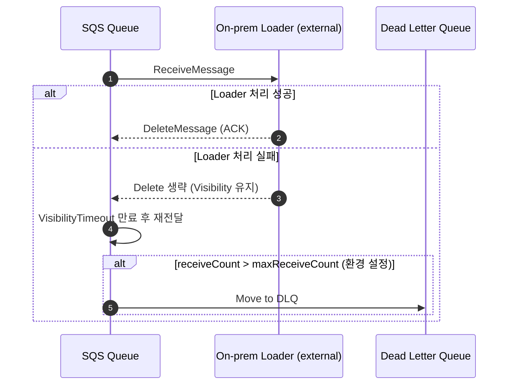

# Load Retry & DLQ Handling (현재 설계 상태)



비고

- Lambda는 별도의 DLQ 알람/SNS를 구성하지 않습니다. 큐 모니터링과 알림은 운영 측에서 추가해야 합니다.
- 재시도/백오프 로직은 온프레미스 로더 구현에 따라 달라지며, 현재 저장소에는 예시 코드만 존재합니다.
- `maxReceiveCount`, `visibility_timeout` 값은 `load_domain_configs` 환경 설정에서 제어합니다.
```
