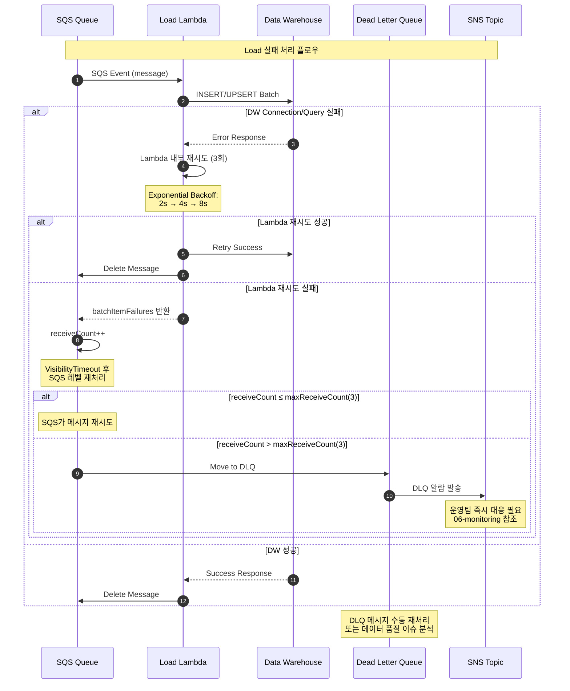

# Load Retry & DLQ Handling

## 재시도 전략 상세

### **Lambda 내부 재시도**
- **횟수**: 3회 (총 4회 시도)
- **백오프**: Exponential (2초 → 4초 → 8초)
- **대상 오류**: Connection timeout, temporary DW errors

### **SQS 레벨 재시도**
- **maxReceiveCount**: 3 (총 3회 SQS 재처리)
- **VisibilityTimeout**: Lambda timeout × 6 (30분)
- **redrive 정책**: 자동 DLQ 이동

### **DLQ 처리**
- **즉시 알람**: SNS → Slack/Email
- **수동 처리**: 운영팀 개입 필요
- **재처리**: DLQ → 원본 Queue 수동 이동

참조: 03-sequence.md (정상 플로우), 06-monitoring-metrics.md (알람 설정)