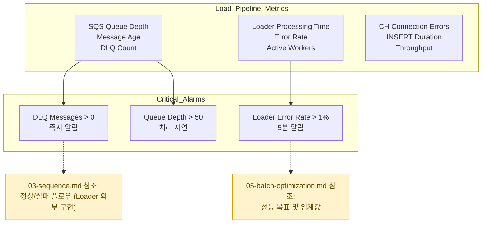

# Load Monitoring & Metrics (Pull Model)

## 핵심 모니터링 지표 (외부 Loader 기준)

## 모니터링 임계값 (05-batch-optimization.md와 통일)

### **SQS 알람**
- **Queue Depth**: > 50개 (처리 지연 감지)
- **Message Age**: > 300초 (오래된 미처리 메시지)
- **DLQ Count**: > 0 (즉시 운영팀 알람)

### **Loader/ClickHouse 성능**
- 아래 값은 온프레미스 Loader가 자체적으로 측정/전송해야 합니다.
- **Processing Time P95**: < 30초/메시지 (타임아웃 5분 하에서)
- **Loader Error Rate**: < 1% (재시도 포함)
- **CH INSERT Duration**: < 1–5초/파일 (크기/압축에 따라 상이)
- **CH Connection Failures**: > 5회/시간 시 경보
- **Throughput**: 10K–50K rows/시간 (업무 기준)

## Dashboard/수집 제안

### **CloudWatch 지표**
- SQS QueueDepth, ApproxAgeOfOldestMessage, DLQMessageCount
- (선택) Loader에서 CloudWatch CustomMetrics로 처리시간/오류율 전송

### **내부 모니터링(대안)**
- 온프레미스 Prometheus/Grafana: Loader와 ClickHouse 지표 스크레이핑

### **운영 대응 가이드**
- **DLQ 메시지 발생**: 03-sequence.md 실패 플로우 분석/재처리
- **성능 저하**: 05-batch-optimization.md 설정 검토(워커/타임아웃/와일드카드)
- **연결 오류**: ClickHouse/네트워크 상태 확인, 백오프/재시도 정책 점검
