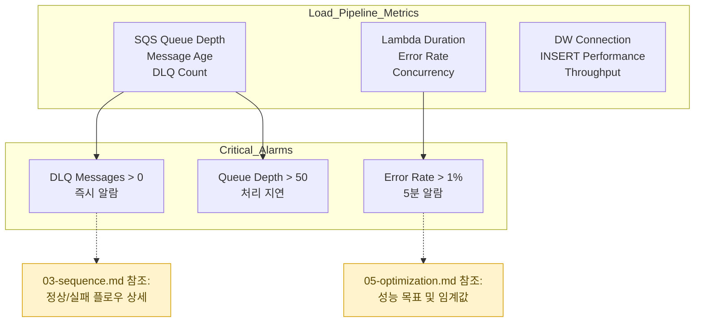

# Load Monitoring & Metrics

## 핵심 모니터링 지표 (03-sequence.md 연동)

## 모니터링 임계값 (05-optimization.md와 통일)

### **SQS 알람**
- **Queue Depth**: > 50개 (처리 지연 감지)
- **Message Age**: > 300초 (오래된 미처리 메시지)
- **DLQ Count**: > 0 (즉시 운영팀 알람)

### **Lambda 성능**
- **Duration P95**: < 30초 (05번 참조 타임아웃 5분)
- **Error Rate**: < 1% (03번 참조 재시도 로직)
- **Throttles**: > 0 (예약 동시성 부족 신호)

### **Data Warehouse**
- **INSERT Duration**: < 1초 평균 (배치 1K-5K rows)
- **Connection Failures**: > 5회/시간 (연결 불안정)
- **Throughput**: 10K-50K rows/시간 (05번 목표치)

## CloudWatch Dashboard 구성

### **Load Pipeline Overview**
- SQS Queue Depth, Lambda Duration, DW Throughput
- DLQ Message Count (실시간 알람)

### **운영 대응 가이드**
- **DLQ 메시지 발생**: 03-sequence.md 실패 플로우 분석
- **성능 저하**: 05-optimization.md 설정 검토
- **연결 오류**: DW 상태 확인 및 재시도 정책 점검