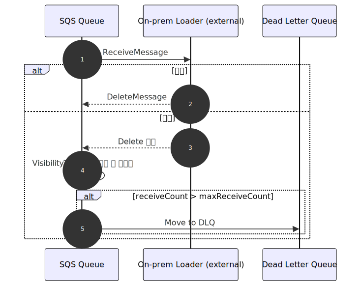

# Load Diagrams Overview

<table style="width:100%; table-layout:fixed;">
  <thead>
    <tr>
      <th style="width:12%;">Diagram</th>
      <th style="width:68%;">미리보기</th>
      <th style="width:20%;">설명</th>
    </tr>
  </thead>
  <tbody>
    <tr>
      <td>Components</td>
      <td></td>
      <td>EventBridge → Lambda → SQS 구성 및 외부 로더 위치</td>
    </tr>
    <tr>
      <td>Data Flow</td>
      <td></td>
      <td>Curated 이벤트에서 ClickHouse 적재까지의 흐름 (외부 로더 전제)</td>
    </tr>
    <tr>
      <td>Sequence</td>
      <td></td>
      <td>Publisher → SQS → Loader 시퀀스</td>
    </tr>
    <tr>
      <td>Retry &amp; DLQ</td>
      <td></td>
      <td>재시도·DLQ 처리 개요</td>
    </tr>
    <tr>
      <td>Batch Optimization</td>
      <td></td>
      <td>폴링/배치/쿼리 최적화 가이드</td>
    </tr>
    <tr>
      <td>Monitoring Metrics</td>
      <td></td>
      <td>운영 시 모니터링해야 할 핵심 지표</td>
    </tr>
  </tbody>
</table>
