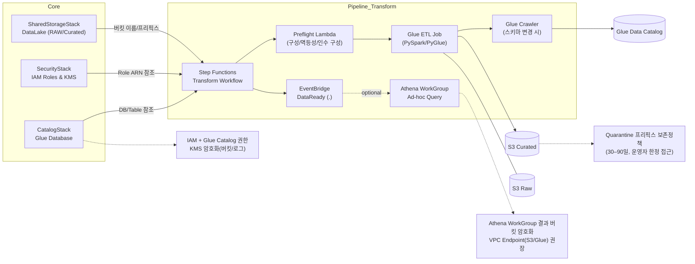

```mermaid
graph LR
  subgraph Core
    SS["SharedStorageStack<br/>DataLake (RAW/Curated)"]
    SEC["SecurityStack<br/>IAM Roles & KMS"]
    GOV["CatalogStack<br/>Glue Database"]
  end

  subgraph Pipeline_Transform
    SFN["Step Functions<br/>Transform Workflow"]
    PRE["Preflight Lambda<br/>(구성/멱등성/인수 구성)"]
    GLUE["Glue ETL Job<br/>(PySpark/PyGlue)"]
    CRAWL["Glue Crawler<br/>(스키마 변경 시)"]
    EV["EventBridge<br/>DataReady (<domain>.<table>)"]
    ATH["Athena WorkGroup<br/>Ad-hoc Query"]
  end

  SS -->|버킷 이름/프리픽스| SFN
  SEC -->|Role ARN 참조| SFN
  GOV -->|DB/Table 참조| SFN

  SFN --> PRE
  PRE --> GLUE
  GLUE --> CRAWL
  GLUE --> CUR[(S3 Curated)]
  GLUE --- RAW[(S3 Raw)]
  CRAWL --> CAT[(Glue Data Catalog)]
  SFN --> EV
  EV -. optional .-> ATH

  %% Governance/Security notes
  N1["IAM + Glue Catalog 권한<br/>KMS 암호화(버킷/로그)"]:::note
  N2["Athena WorkGroup 결과 버킷 암호화<br/>VPC Endpoint(S3/Glue) 권장"]:::note
  N3["Quarantine 프리픽스 보존정책<br/>(30–90일, 운영자 한정 접근)"]:::note
  GOV -.-> N1
  ATH -.-> N2
  CUR -.-> N3

```
