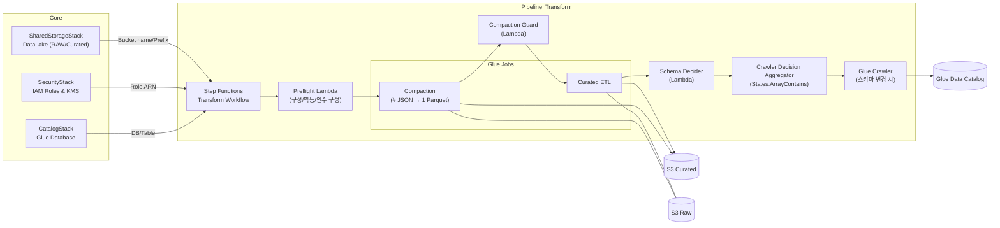

```mermaid
graph LR
  subgraph Core
    SS["SharedStorageStack<br/>DataLake (RAW/Curated)"]
    SEC["SecurityStack<br/>IAM Roles & KMS"]
    GOV["CatalogStack<br/>Glue Database"]
  end

  subgraph Pipeline_Transform
    SFN["Step Functions<br/>Transform Workflow"]
    PRE["Preflight Lambda<br/>(구성/멱등/인수 구성)"]
    subgraph Glue_Jobs["Glue Jobs"]
      COMP["Compaction<br/>(# JSON → 1 Parquet)"]
      GLUE["Curated ETL"]
    end
    GUARD["Compaction Guard<br/>(Lambda)"]
    DECIDE["Schema Decider<br/>(Lambda)"]
    AGG["Crawler Decision Aggregator<br/>(States.ArrayContains)"]
    CRAWL["Glue Crawler<br/>(스키마 변경 시)"]
  end

  SS -->|Bucket name/Prefix| SFN
  SEC -->|Role ARN| SFN
  GOV -->|DB/Table| SFN

  SFN --> PRE
  PRE --> COMP
  COMP --> GUARD --> GLUE --> DECIDE
  DECIDE --> AGG
  AGG --> CRAWL
  GLUE --> CUR[(S3 Curated)]
  GLUE --- RAW[(S3 Raw)]
  COMP --- RAW
  COMP --> CUR
  CRAWL --> CAT[(Glue Data Catalog)]

  %% Governance/Security notes
```
