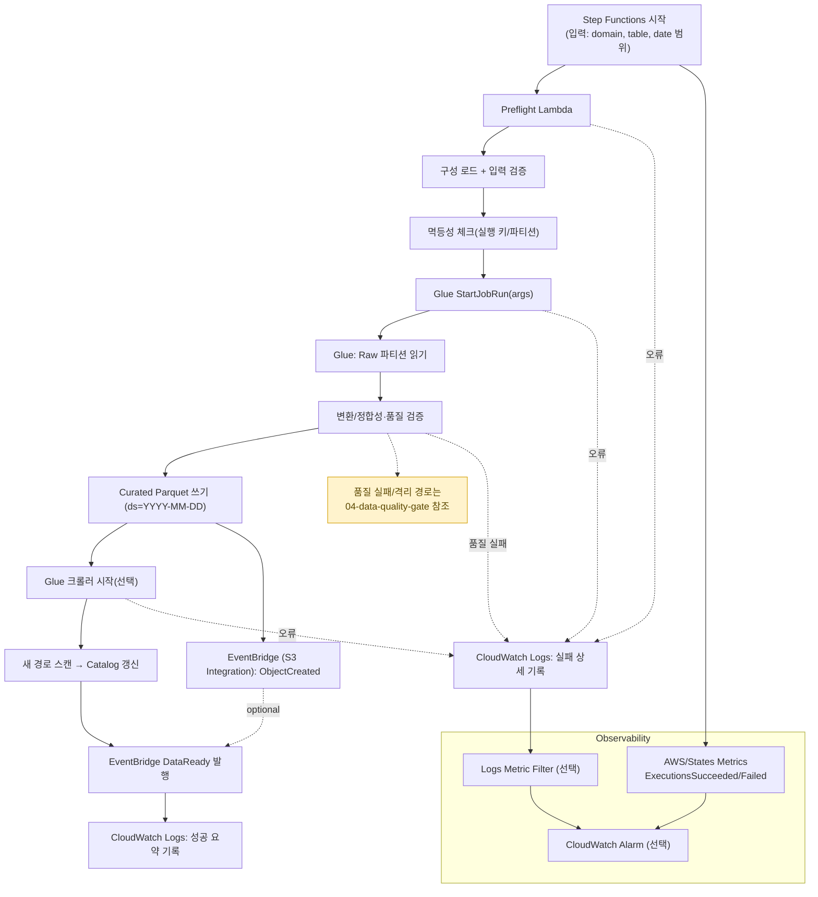

```mermaid
flowchart TD
  A["Step Functions 시작<br/>(입력: domain, table, date 범위)"] --> B["Preflight Lambda"]
  B --> C["구성 로드 + 입력 검증"]
  C --> D["멱등성 체크(실행 키/파티션)"]
  D --> E["Glue StartJobRun(args)"]
  E --> F["Glue: Raw 파티션 읽기"]
  F --> G["변환/정합성·품질 검증"]
  G --> H["Curated Parquet 쓰기 (ds=YYYY-MM-DD)"]
  H --> I["Glue 크롤러 시작(선택)"]
  I --> J["새 경로 스캔 → Catalog 갱신"]
  J --> K["EventBridge DataReady 발행"]
  K --> L["CloudWatch Logs: 성공 요약 기록"]

  %% DQ 상세 참고 노트
  NDQ["품질 실패/격리 경로는<br/>04-data-quality-gate 참조"]:::note
  G -.-> NDQ

  %% 오류/우회 경로
  B -. 오류 .-> X["CloudWatch Logs: 실패 상세 기록"]
  E -. 오류 .-> X
  G -. 품질 실패 .-> X
  I -. 오류 .-> X

  %% 메트릭/알람
  subgraph Observability
    M1["AWS/States Metrics<br/>ExecutionsSucceeded/Failed"]
    M2["Logs Metric Filter (선택)"]
    A1["CloudWatch Alarm (선택)"]
  end
  A --> M1
  X --> M2
  M1 --> A1
  M2 --> A1

  H --> EB["EventBridge (S3 Integration): ObjectCreated"]
  EB -. optional .-> K

  classDef note fill:#fff3cd,stroke:#d39e00,color:#5c4800;
```
