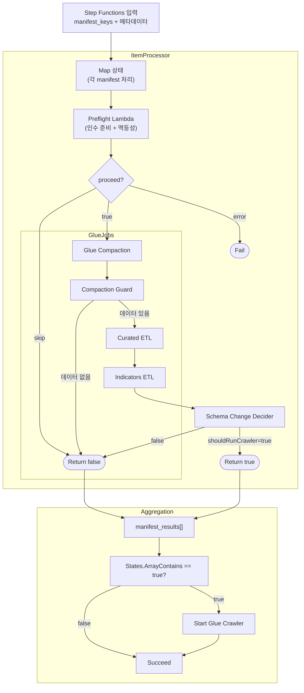

```mermaid
flowchart TD
  A["Step Functions 입력<br/>manifest_keys + 메타데이터"] --> B["Map 상태<br/>(각 manifest 처리)"]

  subgraph ItemProcessor
    B --> C["Preflight Lambda\n(인수 준비 + 멱등성)"]
    C --> D{proceed?}
    D -->|skip| SKIP(["Return false"])
    D -->|error| FAIL(["Fail"])
    D -->|true| COMP["Glue Compaction"]
    subgraph GlueJobs
      COMP --> GUARD["Compaction Guard"]
      GUARD -->|데이터 없음| SKIP
      GUARD -->|데이터 있음| ETL["Curated ETL"]
      ETL --> IND["Indicators ETL"]
  end
    IND --> DECIDE["Schema Change Decider"]
    DECIDE -->|shouldRunCrawler=true| TRUE(["Return true"])
    DECIDE -->|false| SKIP
  end

  SKIP --> Z
  TRUE --> Z

  subgraph Aggregation
    Z["manifest_results[]"] --> AGG["States.ArrayContains == true?"]
    AGG -->|true| CRAWLER["Start Glue Crawler"]
    AGG -->|false| DONE["Succeed"]
    CRAWLER --> DONE
  end
```
