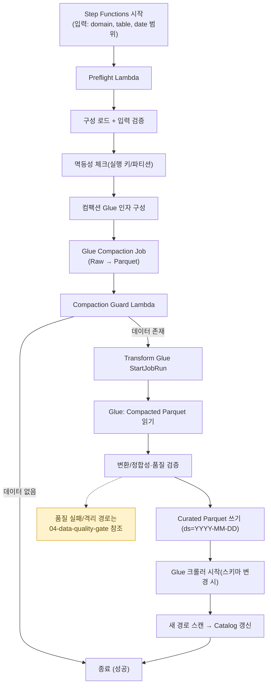

```mermaid
flowchart TD
  A["Step Functions 시작<br/>(입력: domain, table, date 범위)"] --> B["Preflight Lambda"]
  B --> C["구성 로드 + 입력 검증"]
  C --> D["멱등성 체크(실행 키/파티션)"]
  D --> E["컴팩션 Glue 인자 구성"]
  E --> F["Glue Compaction Job<br/>(Raw → Parquet)"]
  F --> G["Compaction Guard Lambda"]
  G -->|데이터 존재| H["Transform Glue StartJobRun"]
  G -->|데이터 없음| S["종료 (성공)"]
  H --> I["Glue: Compacted Parquet 읽기"]
  I --> J["변환/정합성·품질 검증"]
  J --> K["Curated Parquet 쓰기 (ds=YYYY-MM-DD)"]
  K --> L["Glue 크롤러 시작(스키마 변경 시)"]
  L --> M["새 경로 스캔 → Catalog 갱신"]
  M --> S

  %% DQ 상세 참고 노트
  NDQ["품질 실패/격리 경로는<br/>04-data-quality-gate 참조"]:::note
  J -.-> NDQ

  %% 오류/우회 경로: 단순화 위해 생략(핵심 플로우만 표시)

  

  classDef note fill:#fff3cd,stroke:#d39e00,color:#5c4800;
```
