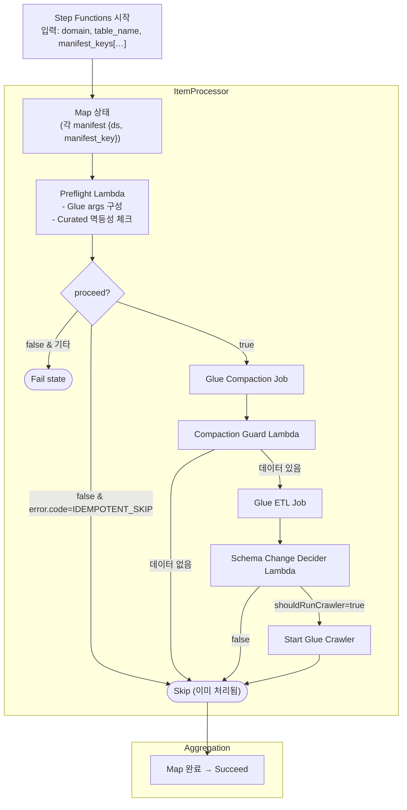

```mermaid
flowchart TD
  A["Step Functions 시작<br/>입력: domain, table_name, manifest_keys[…]"] --> B["Map 상태<br/>(각 manifest {ds, manifest_key})"]

  subgraph ItemProcessor
    B --> C["Preflight Lambda\n- Glue args 구성\n- Curated 멱등성 체크"]
    C --> D{proceed?}
    D -->|false & error.code=IDEMPOTENT_SKIP| SKIP(["Skip (이미 처리됨)"])
    D -->|false & 기타| FAIL(["Fail state"])
    D -->|true| COMP["Glue Compaction Job"]
    COMP --> GUARD["Compaction Guard Lambda"]
    GUARD -->|데이터 없음| SKIP
    GUARD -->|데이터 있음| ETL["Glue ETL Job"]
    ETL --> DECIDE["Schema Change Decider Lambda"]
    DECIDE -->|shouldRunCrawler=true| CRAWLER["Start Glue Crawler"]
    DECIDE -->|false| SKIP
    CRAWLER --> SKIP
  end

  SKIP --> Z

  subgraph Aggregation
    Z["Map 완료 → Succeed"]
  end
```
