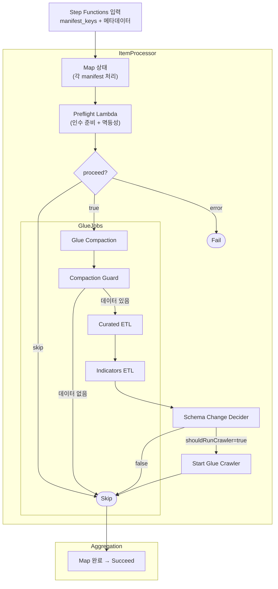

```mermaid
flowchart TD
  A["Step Functions 입력<br/>manifest_keys + 메타데이터"] --> B["Map 상태<br/>(각 manifest 처리)"]

  subgraph ItemProcessor
    B --> C["Preflight Lambda\n(인수 준비 + 멱등성)"]
    C --> D{proceed?}
    D -->|skip| SKIP(["Skip"])
    D -->|error| FAIL(["Fail"])
    D -->|true| COMP["Glue Compaction"]
    subgraph GlueJobs
      COMP --> GUARD["Compaction Guard"]
      GUARD -->|데이터 없음| SKIP
      GUARD -->|데이터 있음| ETL["Curated ETL"]
      ETL --> IND["Indicators ETL"]
  end
    IND --> DECIDE["Schema Change Decider"]
    DECIDE -->|shouldRunCrawler=true| CRAWLER["Start Glue Crawler"]
    DECIDE -->|false| SKIP
    CRAWLER --> SKIP
  end

  SKIP --> Z

  subgraph Aggregation
    Z["Map 완료 → Succeed"]
  end
```
