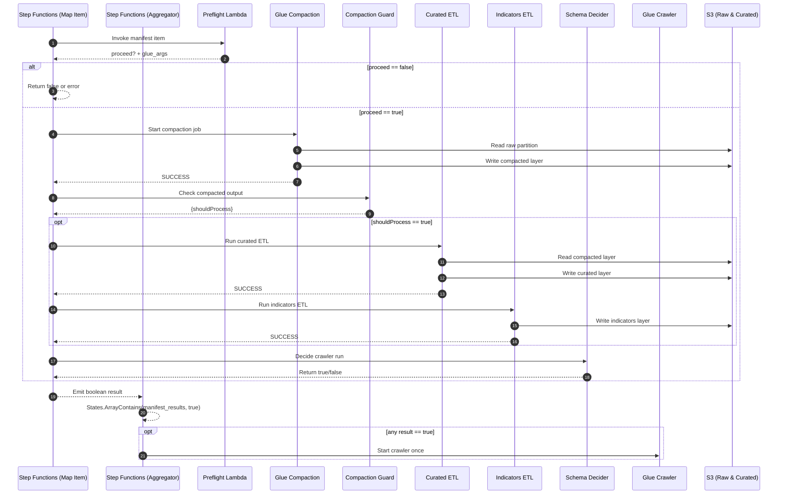

```mermaid
sequenceDiagram
  autonumber
  participant SF as Step Functions (Map Item)
  participant AGG as Step Functions (Aggregator)
  participant PRE as Preflight Lambda
  participant COMP as Glue Compaction
  participant GUARD as Compaction Guard
  participant ETL as Curated ETL
  participant IND as Indicators ETL
  participant DEC as Schema Decider
  participant CR as Glue Crawler
  participant S3 as S3 (Raw & Curated)

  SF->>PRE: Invoke manifest item
  PRE-->>SF: proceed? + glue_args
  alt proceed == false
    SF-->>SF: Return false or error
  else proceed == true
    SF->>COMP: Start compaction job
    COMP->>S3: Read raw partition
    COMP->>S3: Write compacted layer
    COMP-->>SF: SUCCESS
    SF->>GUARD: Check compacted output
    GUARD-->>SF: {shouldProcess}
    opt shouldProcess == true
      SF->>ETL: Run curated ETL
      ETL->>S3: Read compacted layer
      ETL->>S3: Write curated layer
      ETL-->>SF: SUCCESS
      SF->>IND: Run indicators ETL
      IND->>S3: Write indicators layer
      IND-->>SF: SUCCESS
    end
    SF->>DEC: Decide crawler run
    DEC-->>SF: Return true/false
  end
  SF-->>AGG: Emit boolean result
  AGG-->>AGG: States.ArrayContains(manifest_results, true)
  opt any result == true
    AGG->>CR: Start crawler once
  end
```
