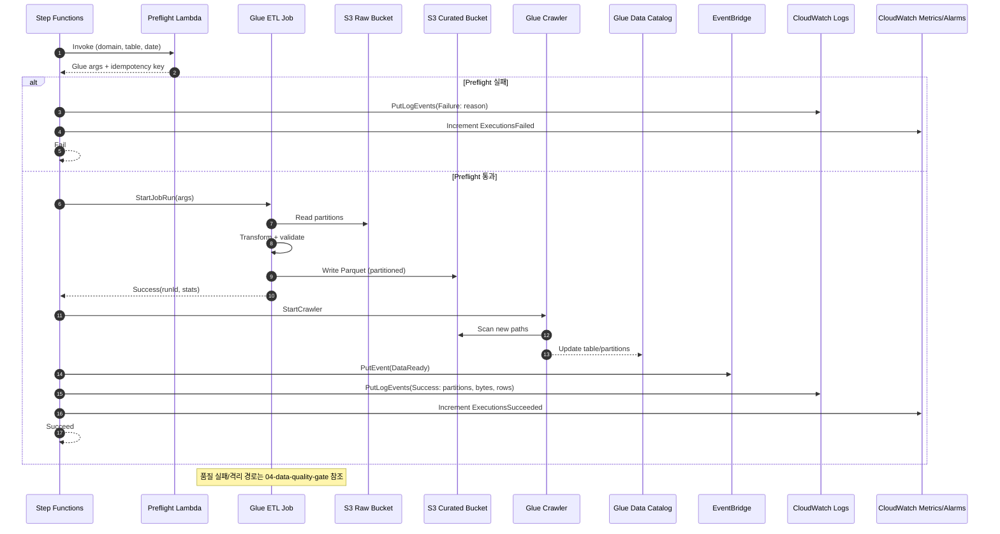

```mermaid
sequenceDiagram
  autonumber
  participant SF as Step Functions
  participant PRE as Preflight Lambda
  participant GLUE as Glue ETL Job
  participant RAW as S3 Raw Bucket
  participant CUR as S3 Curated Bucket
  participant CR as Glue Crawler
  participant CAT as Glue Data Catalog
  participant EV as EventBridge
  participant CWL as CloudWatch Logs
  participant CWM as CloudWatch Metrics/Alarms

  SF->>PRE: Invoke (domain, table, date)
  PRE-->>SF: Glue args + idempotency key
  alt Preflight 실패
    SF->>CWL: PutLogEvents(Failure: reason)
    SF->>CWM: Increment ExecutionsFailed
    SF-->>SF: Fail
  else Preflight 통과
    SF->>GLUE: StartJobRun(args)
    GLUE->>RAW: Read partitions
    GLUE->>GLUE: Transform + validate
    GLUE->>CUR: Write Parquet (partitioned)
    GLUE-->>SF: Success(runId, stats)
    SF->>CR: StartCrawler
    CR->>CUR: Scan new paths
    CR-->>CAT: Update table/partitions
    SF->>EV: PutEvent(DataReady)
    SF->>CWL: PutLogEvents(Success: partitions, bytes, rows)
    SF->>CWM: Increment ExecutionsSucceeded
    SF-->>SF: Succeed
  end

  Note over GLUE: 품질 실패/격리 경로는 04-data-quality-gate 참조
```
