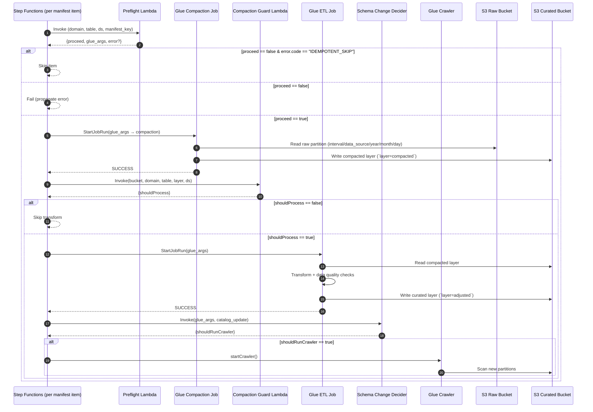

```mermaid
sequenceDiagram
  autonumber
  participant SF as Step Functions (per manifest item)
  participant PRE as Preflight Lambda
  participant COMP as Glue Compaction Job
  participant GUARD as Compaction Guard Lambda
  participant ETL as Glue ETL Job
  participant DEC as Schema Change Decider
  participant CR as Glue Crawler
  participant RAW as S3 Raw Bucket
  participant CUR as S3 Curated Bucket

  SF->>PRE: Invoke (domain, table, ds, manifest_key)
  PRE-->>SF: {proceed, glue_args, error?}
  alt proceed == false & error.code == "IDEMPOTENT_SKIP"
    SF-->>SF: Skip item
  else proceed == false
    SF-->>SF: Fail (propagate error)
  else proceed == true
    SF->>COMP: StartJobRun(glue_args → compaction)
    COMP->>RAW: Read raw partition (interval/data_source/year/month/day)
    COMP->>CUR: Write compacted layer (`layer=compacted`)
    COMP-->>SF: SUCCESS
    SF->>GUARD: Invoke(bucket, domain, table, layer, ds)
    GUARD-->>SF: {shouldProcess}
    alt shouldProcess == false
      SF-->>SF: Skip transform
    else shouldProcess == true
      SF->>ETL: StartJobRun(glue_args)
      ETL->>CUR: Read compacted layer
      ETL->>ETL: Transform + data quality checks
      ETL->>CUR: Write curated layer (`layer=adjusted`)
      ETL-->>SF: SUCCESS
      SF->>DEC: Invoke(glue_args, catalog_update)
      DEC-->>SF: {shouldRunCrawler}
      alt shouldRunCrawler == true
        SF->>CR: startCrawler()
        CR->>CUR: Scan new partitions
      end
    end
  end
```
