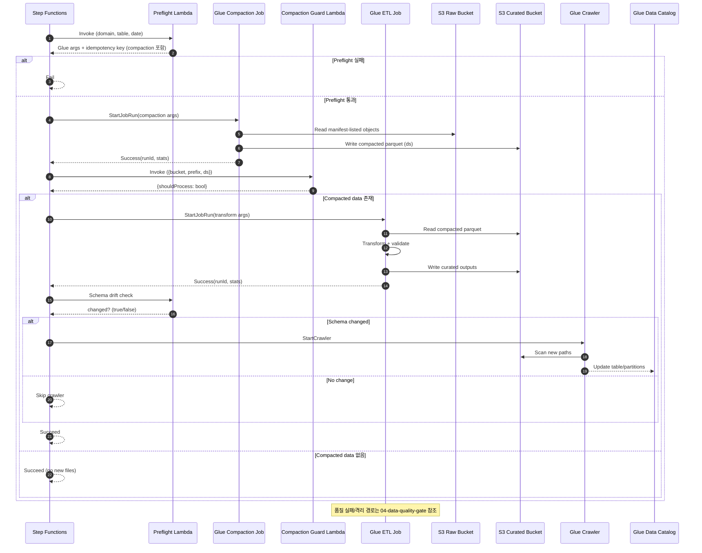

```mermaid
sequenceDiagram
  autonumber
  participant SF as Step Functions
  participant PRE as Preflight Lambda
  participant COMP as Glue Compaction Job
  participant GUARD as Compaction Guard Lambda
  participant GLUE as Glue ETL Job
  participant RAW as S3 Raw Bucket
  participant CUR as S3 Curated Bucket
  participant CR as Glue Crawler
  participant CAT as Glue Data Catalog
  

  SF->>PRE: Invoke (domain, table, date)
  PRE-->>SF: Glue args + idempotency key (compaction 포함)
  alt Preflight 실패
    SF-->>SF: Fail
  else Preflight 통과
    SF->>COMP: StartJobRun(compaction args)
    COMP->>RAW: Read manifest-listed objects
    COMP->>CUR: Write compacted parquet (ds)
    COMP-->>SF: Success(runId, stats)
    SF->>GUARD: Invoke ({bucket, prefix, ds})
    GUARD-->>SF: {shouldProcess: bool}
    alt Compacted data 존재
      SF->>GLUE: StartJobRun(transform args)
      GLUE->>CUR: Read compacted parquet
      GLUE->>GLUE: Transform + validate
      GLUE->>CUR: Write curated outputs
      GLUE-->>SF: Success(runId, stats)
      SF->>PRE: Schema drift check
      PRE-->>SF: changed? (true/false)
      alt Schema changed
        SF->>CR: StartCrawler
        CR->>CUR: Scan new paths
        CR-->>CAT: Update table/partitions
      else No change
        SF-->>SF: Skip crawler
      end
      SF-->>SF: Succeed
    else Compacted data 없음
      SF-->>SF: Succeed (no new files)
    end
  end

  Note over GLUE: 품질 실패/격리 경로는 04-data-quality-gate 참조
```
