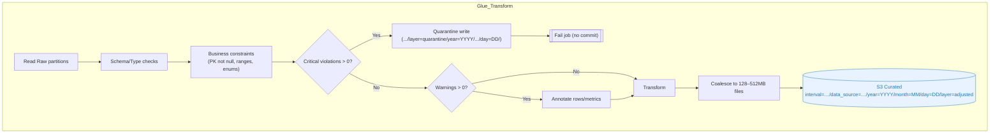

```mermaid
flowchart TD
  subgraph Glue_Transform
    R["Read Raw partitions"] --> S["Schema/Type checks"]
    S --> C["Business constraints<br/>(PK not null, ranges, enums)"]
    C --> D{Critical violations > 0?}
    D -->|Yes| Q["Quarantine write<br/>(.../layer=quarantine/year=YYYY/.../day=DD/)"]
    Q --> F[["Fail job (no commit)"]]
    D -->|No| W{Warnings > 0?}
    W -->|Yes| AN["Annotate rows/metrics"]
    W -->|No| T["Transform"]
    AN --> T
    T --> CO["Coalesce to 128–512MB files"]
    CO --> CUR[("S3 Curated<br/>interval=…/data_source=…/year=YYYY/month=MM/day=DD/layer=adjusted")]
  end

  classDef store fill:#e8f3ff,stroke:#1f77b4,color:#1f77b4;
  class CUR store;
```
